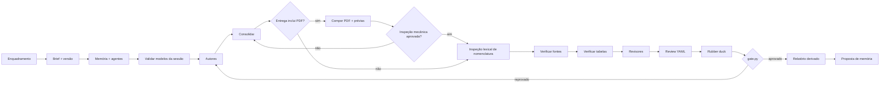

# Document Swarm 🐝

[](https://orcid.org/0009-0006-0765-4201)
[](https://creativecommons.org/licenses/by/4.0/)
[](https://github.com/github/copilot-cli)
[](https://github.com/EdneiMonteiro/document-swarm/commits)

Skill do GitHub Copilot CLI para produzir documentos substanciais com um enxame
de agentes declarativos: autores, revisores, coordenador e rubber duck.

O fluxo combina julgamento editorial por agentes com verificações
determinísticas para URLs, aritmética de tabelas, proveniência de modelos, portão
de notas e relatório final.

> **Fonte da verdade:** [`SKILL.md`](./SKILL.md)
>
> **Versão atual:** `3.6.0`
>
> **Histórico:** [`CHANGELOG.md`](./CHANGELOG.md)

## O que a skill entrega

- **Documentos Markdown:** playbooks, whitepapers, relatórios, RFCs, políticas,
  guias técnicos e comparativos.
- **PDF profissional opcional:** ReportLab/Platypus com perfis de livro didático
  e relatório técnico, fontes incorporadas, sumário, tabelas, fórmulas e gráficos
  vetoriais; prévias e inspeção vinculadas aos arquivos gerados.
- **Apresentações opcionais:** uma fonte estruturada gera HTML navegável offline,
  um PowerPoint fiel por imagens e um PowerPoint com objetos editáveis, com
  inspeção dos arquivos salvos e ensaio no PowerPoint instalado.
- **Evolução de documentos existentes:** reativa o enxame completo e revalida
  tópicos antigos e novos.
- **Rastreabilidade:** brief, agentes, modelos, fontes, ciclos, notas e checks.
- **Monitor visual local:** grafo de agentes, estados observados, rodadas, notas
  por revisor, bloqueios e histórico, em canvas ou navegador.
- **Executor determinístico opcional:** o código conduz o ciclo, em paralelo e
  retomável, e os agentes ficam só com o que exige julgamento; as notas e a
  aprovação continuam sendo dos revisores e do `gate.py`.
- **Memória curada:** fontes e perfis aprovados podem ser reutilizados por swarms
  futuros sem aceitar avisos ou falhas.

O portão usa a escala `D- ... A+`: **A- não passa**. Um achado crítico do rubber
duck também bloqueia.

O padrão é documento. Apresentações são um tipo de entrega opcional, ativado por
pedido explícito, e não acrescentam dependência ao caminho documental.

## Perfil editorial técnico

Documentos de arquitetura de nuvem adotam, por padrão, o perfil
**Principal Cloud Solution Architect**: escrita natural e direta, rigor técnico,
trade-offs explícitos e utilidade para decisão, sem linguagem promocional.
O público e o perfil ficam no brief; a senioridade da análise não obriga o uso
de jargão com executivos nem substitui a especialidade dos autores.

Não há agente novo: autores aplicam a diretriz, revisores existentes avaliam
clareza, completude decisória e fatos, e o coordenador mantém a uniformidade.
Outros domínios adaptam o perfil no enquadramento, sem forçar conteúdo de nuvem.
As regras e a distribuição por papel estão no
[contrato editorial](./SKILL.md#21-perfil-editorial-técnico).

Na versão 3.2, a revisão editorial é explícita e separada da diagramação:
títulos, aberturas, corpo, legendas e conclusões recebem avaliação da redação.
Slogans, metatexto vazio e antíteses decorativas são tratados como defeitos,
sem proibir negativas técnicas ou comparações necessárias.

O gate exige revisão integral do ciclo atual, trechos concretos, correspondência
com o relatório individual e hashes do texto e de todas as entregas. Uma nota
visual ou um argumento arquitetural correto não compensam uma reprovação
editorial. Na 3.2.1, as justificativas devem examinar **linguagem, referentes,
tom e autonomia do trecho**. O auditor devolve ao revisor aprovações sem
fundamentação, sem substituir suas notas silenciosamente.

Os scripts conferem o contrato,
não detectam autoria por IA nem atribuem notas de estilo. Veja
[formato e critérios da revisão editorial](./docs/editorial-review.md).

Na versão 3.2.2, nomes descritivos são o padrão da entrega ao cliente.
Siglas e códigos necessários devem ser explicados no primeiro uso e nas
legendas de figuras/cards que precisem funcionar isoladamente. Convenções
locais são distintas de padrões referenciados; os IDs internos da matriz
continuam preservados. A inspeção lexical auxilia os revisores sem inventar
significados ou aprovar a nomenclatura.

Atualizar os templates não modifica agentes ou entregas já gerados. Ajustes de
instruções existentes precisam ser explícitos; aplicar o perfil ao conteúdo
exige o modo evolução, sem reaproveitar notas como aprovação retroativa.

## Instalação

### Linux/macOS

```bash
git clone <url-deste-repo> ~/Projects/document-swarm
cd ~/Projects/document-swarm
./scripts/install.sh
```

### Windows (PowerShell)

```powershell
git clone <url-deste-repo> "$HOME\Projects\document-swarm"
Set-Location "$HOME\Projects\document-swarm"
pwsh .\scripts\install.ps1
```

Os instaladores criam links gerenciados para a skill e as extensões habilitadas:

- `~/.copilot/skills/document-swarm` aponta para o clone;
- `~/.copilot/extensions/document-swarm-monitor` aponta para a extensão do clone;
- `~/.copilot/extensions/document-swarm-pdf` é incluído com `--with-pdf` ou
  `-WithPdf`, independentemente da opção de monitor.

Isso permite usar as extensões também em outros projetos. Reinicie o Copilot CLI
para redescobrir skill e extensão. Instalações repetidas são idempotentes;
diretórios reais ou links de outro destino não são apagados.
Quando a cópia do projeto e a pessoal coexistem, a pessoal fica em espera para
não registrar a mesma ferramenta duas vezes.

Os checks usam apenas Python 3 e sua biblioteca padrão. Os instaladores não
instalam dependências npm ou ferramentas de apresentações. O monitor usa o SDK
de extensões do Copilot e Node.js 20+; o pipeline documental continua funcionando
quando a extensão não estiver disponível.

Para instalar somente a skill, use `--without-monitor` no Bash ou
`-WithoutMonitor` no PowerShell. A opção remove apenas o link global gerenciado
do monitor, se existir, sem apagar seu código. Dentro deste próprio projeto, a
extensão ainda pode ser descoberta em `.github/extensions/`; use `monitor: false`
no brief para desativá-la naquela execução.

## Monitor visual

Por padrão, o coordenador abre o painel após criar o brief e antes dos agentes.
O canvas é preferido; se não estiver disponível, a mesma interface abre no
navegador local. Canvas depende do suporte experimental do host.

O painel abre compacto, com referência de **720 × 480 px**, indicadores em uma
faixa e abas **Fluxo**, **Notas**, **Histórico** e **Detalhes**. O botão
**Expandir** usa a área disponível quando necessário. A rolagem fica dentro das
abas, em vez de transformar o monitor em uma página longa.
No canvas nativo do Copilot no Windows, a janela acompanha o tamanho compacto,
considerando a escala da tela; **Expandir/Compactar** também ajustam essa janela.
Abas comuns do navegador e hosts sem esse suporte mantêm o tamanho definido
pelo usuário.

Os estados vêm do runtime e os marcos vêm do coordenador. O painel não inicia,
pausa ou reinicia agentes, não inventa notas e não transforma tarefa concluída em
documento aprovado. Fechar a tela não encerra o trabalho.
**Disponível** indica um subagente entre turnos, sem pressupor ação sua. A
atividade do principal é mostrada separadamente, e o encerramento solicitado
pelo coordenador aguarda a confirmação de ociosidade da sessão.

Use `monitor: false` no brief ou peça uma execução sem monitor para não abrir o
painel. Falhas da interface são avisadas e não alteram os critérios de qualidade.
Veja [uso, arquitetura, segurança e diagnóstico](./docs/monitor.md).

## Vigia de saúde e retomada

Uma execução pode parar sem aviso. A extensão mede continuamente a idade da
observação mais recente, fora do laço do agente, e publica
`reports/progress/<id>/health.json`. Um terminal congelado reportando
"processando" é classificado como parado, porque a medida decide e o rótulo
apenas explica.

```powershell
python .\scripts\checks\health.py <pasta-do-swarm> --threshold 180
python .\scripts\checks\resume.py <pasta-do-swarm> --check reports\resume.json
```

`health.py` publica a tabela no terminal; `resume.py` projeta o próximo passo
determinístico e grava um registro durável com os hashes que o sustentam. Em uma
sessão nova, um artefato alterado força recálculo em vez de confiança no registro.

O coordenador arma um prompt agendado a cada 5 minutos, que imprime a tabela e,
só quando o estado é `stalled`, executa uma recuperação do catálogo R1–R5. Cada
recuperação é registrada e aparece no relatório final. Tetos: uma ação por tique,
duas por agente por ciclo, seis por execução.

O vigia recupera execução, nunca qualidade: não atribui nota, não pula revisor ou
rubber duck e não aprova entrega. Se o laço do agente estiver travado, nenhum
prompt agendado executa; a detecção continua e a retomada acontece na sessão
seguinte. Detalhes no [guia do monitor](./docs/monitor.md#saúde-da-execução-e-retomada).

## Executor determinístico

No fluxo padrão, o coordenador conduz o ciclo turno a turno, e a maior parte do tempo
de relógio se perde entre os turnos. Em treze execuções medidas (53,3 h), algum agente
rodava em 25 % do tempo, a máquina dormia em 18 % e ficava acordada sem nenhum agente
rodando em 57 %. O executor opcional faz em código o que o contrato já determina e
deixa com agentes só a autoria, a consolidação, a revisão independente e o rubber
duck. Nenhuma exigência de qualidade muda: as notas vêm dos revisores e só o
`gate.py` aprova.

```powershell
python .\scripts\orchestration run <pasta-do-swarm> --plan-only
python .\scripts\orchestration run <pasta-do-swarm> --parallel 4
```

Cada agente roda como um processo `copilot` não interativo, com só as ferramentas do
seu papel, sem escrita e sem comandos, e o resultado volta como JSON validado. O mesmo
comando retoma uma execução parada. Só um `run` opera um swarm por vez, e Ctrl+C
encerra os agentes em andamento sem perder o que já terminou. Esta versão cobre
documentos Markdown novos; o
backend foi testado com um CLI substituto e deve ser qualificado com o comando
`qualify`, que faz poucas chamadas reais e exige `--yes`. Veja o
[guia do executor](./docs/executor.md).

## PDFs profissionais

O motor lê o Markdown autoral e gera um bundle com PDF, prévias PNG, texto
extraído, manifesto e inspeção JSON. Os perfis combinam capa vetorial, texto
justificado e fontes abertas incorporadas. A composição não depende de fontes
do Windows ou caminhos fixos de instalação.

As dependências são opcionais:

```powershell
python -m venv .venv-pdf
.\.venv-pdf\Scripts\python.exe -m pip install -r requirements-pdf.txt
.\.venv-pdf\Scripts\python.exe -m scripts.pdf render --source documento.md --destination saida-pdf --profile textbook --language pt-BR
```

Use uma pasta nova para cada composição. Para expor `docswarm_pdf` também em
outros projetos, execute `scripts\install.ps1 -WithPdf` ou
`scripts/install.sh --with-pdf`; isso registra a extensão, sem instalar pacotes.

O fluxo é fonte → composição/inspeção → prévias → revisão editorial e visual →
gate. Os checks usuais continuam stdlib-only. A inspeção detecta classes de
defeitos mecânicos, mas não dá nota de redação. Consulte [o guia PDF](./docs/pdf.md)
para a sintaxe de figuras/fórmulas, licenças, limites e testes com defeitos injetados.

## Apresentações

Quando a entrega for em slides, a mesma fonte estruturada produz três formatos:
`index.html` navegável e offline, `deck-faithful.pptx` por imagens e
`deck-editable.pptx` com título, texto, tabelas, formas e conectores nativos.
Apoios abrem em diálogo no HTML e ficam ocultos da sequência normal no
PowerPoint, alcançados pelos links visíveis.

```powershell
python -m venv .venv-presentations
.\.venv-presentations\Scripts\python.exe -m pip install -r requirements-presentations.txt
.\.venv-presentations\Scripts\python.exe -m playwright install chromium
.\.venv-presentations\Scripts\python.exe -m scripts.presentations preflight --swarm <swarm>
```

O preflight qualifica implementação e ambiente em material sintético e mede o
PowerPoint instalado. A composição usa um destino novo, inspeciona os arquivos
salvos e vincula a aprovação aos seus hashes. O portão reconstrói páginas,
navegação e cobertura a partir da fonte, então um exportador não pode encolher o
que precisa ser revisado. Consulte [o guia de apresentações](./docs/presentations.md).

## Como disparar

### Documento

```text
Implemente um playbook de arquitetura Zero Trust no Azure para arquitetos sêniores.
```

```text
Crie um comparativo técnico entre <A>, <B> e <C>, com recomendação executiva.
```

```text
Crie um relatório sobre <tema> em Markdown e PDF, com o perfil visual technical-report.
```

### Evolução

```text
Evolua o swarm <id>: adicione um modelo de maturidade e diagramas.
```

Pedidos curtos, como e-mail ou parágrafo, não devem disparar a skill.

## Fluxo resumido



A inspeção lexical não aprova nomenclatura, e a inspeção mecânica não aprova
redação. As notas factuais, editoriais e visuais continuam sob responsabilidade
dos revisores.

Com o [executor determinístico](./docs/executor.md#o-ciclo), o mesmo ciclo é conduzido
por código: autores, consolidação, checagens em paralelo, revisores, matriz, rubber
duck e portão, com reparo dirigido aos autores afetados quando uma checagem mecânica
falha.

O diagrama histórico do pipeline de validação da versão 2.0 está em
[`docs/project/fluxo-ideal.excalidraw`](./docs/project/fluxo-ideal.excalidraw).
A arquitetura da observação visual está no [guia do monitor](./docs/monitor.md#arquitetura).

## Checks determinísticos

Os scripts ficam em [`scripts/checks/`](./scripts/checks/) e usam somente a
biblioteca padrão do Python.

| Script | Responsabilidade |
|---|---|
| `verify_sources.py` | Testa URLs em paralelo (até 3 por host), classifica `ok/warn/fail` e mantém cache. |
| `verify_tables.py` | Recalcula tabelas Markdown explicitamente auditáveis. |
| `lint_agents.py` | Valida frontmatter, modelo declarado e swarm do agente. |
| `gate.py` | Aplica a régua, o veto crítico, o limite de ciclos e o contrato editorial da entrega. |
| `progress.py` | Projeta os artefatos para o monitor, sem modificá-los ou aprovar conteúdo. |
| `health.py` | Compõe a tabela de saúde da execução a partir de medições; diz "não observado" em vez de inventar. |
| `resume.py` | Projeta o próximo passo determinístico e grava `resume.json` vinculado a hashes. |
| `inspect_nomenclature.py` | Lista candidatos a siglas/códigos e suas ocorrências, sem avaliar significado ou dar nota. |
| `final_report.py` | Deriva os fatos do relatório final dos artefatos estruturados. |
| `update_memory.py` | Propõe e, após aprovação explícita, atualiza a memória. |
| `pdf_contract.py` | Verifica no gate os hashes e resultados do motor PDF opcional, sem importar suas dependências. |
| `presentation_contract.py` | Reconstrói páginas, navegação e cobertura de uma apresentação e confronta os registros com os arquivos reais. |

O executor determinístico opcional fica em [`scripts/orchestration/`](./scripts/orchestration/),
também só com a biblioteca padrão, e se usa por `python scripts\orchestration <comando>`:
`init`, `next`, `record`, `status`, `run`, `qualify` e `metrics`. Ele não é um portão:
quem aprova continua sendo o `gate.py`.

Detalhes operacionais, formatos e exit codes:

- [Matriz computável e portão](./SKILL.md#6-régua-e-matriz-computável)
- [Evidência e cache](./SKILL.md#7-evidência-e-cache-de-fontes)
- [Tabelas auditáveis](./SKILL.md#8-tabelas-auditáveis)
- [Loop determinístico](./SKILL.md#fase-3--loop-determinístico-por-ciclo)
- [Vigia de saúde e retomada](./SKILL.md#26-vigia-de-saúde-e-retomada)
- [Executor determinístico](./SKILL.md#27-executor-determinístico-opcional)
- [Referência dos scripts](./SKILL.md#14-referência-dos-scripts-determinísticos)

## Estrutura de uma execução

```text
<OUTPUT_ROOT>/<YYYY-MM-DD>-SWARM-<XX>/
├─ brief.md
├─ agents/
├─ reports/
│  ├─ agent-models.md
│  ├─ cycle-0N-review.md
│  ├─ cycle-0N-review.yaml
│  ├─ cycle-0N-reviewer-<id>.json
│  ├─ cycle-0N-editorial-text.txt
│  ├─ cycle-0N-nomenclature.json
│  ├─ cycle-0N-gate.json
│  ├─ cycle-0N-tables-check.json
│  ├─ progress/<execution_id>/
│  │  ├─ snapshot.json
│  │  ├─ events.jsonl
│  │  └─ health.json
│  ├─ execution/             # somente quando o executor determinístico conduz o ciclo
│  │  ├─ plan.json
│  │  ├─ journal.jsonl
│  │  ├─ results/
│  │  ├─ feedback/
│  │  ├─ documents/
│  │  ├─ checks/
│  │  ├─ usage/
│  │  └─ driver.json
│  ├─ resume.json
│  └─ final-report.md
├─ sources/
│  ├─ sources-index.md
│  └─ sources-check.json
└─ output/
   ├─ <documento-final>.md
   ├─ pdf-cycle-0N/
   │  ├─ document.pdf
   │  ├─ previews/
   │  ├─ editorial-text.txt
   │  ├─ layout.json
   │  ├─ manifest.json
   │  └─ inspection.json
   └─ presentation-cycle-0N/
      ├─ deck.json
      ├─ layout.json
      ├─ index.html
      ├─ runtime/
      ├─ deck-faithful.pptx
      ├─ deck-editable.pptx
      └─ LEIA-ME.txt
```

As pastas `pdf-cycle-0N/` e `presentation-cycle-0N/` são opcionais e existem
quando o formato integra a entrega. Cada nova composição usa uma pasta nova,
preservando os artefatos já avaliados.

`<OUTPUT_ROOT>` é resolvido nesta ordem:

1. destino explícito no pedido;
2. variável `DOCSWARM_ROOT`;
3. `<clone>/swarms`.

As entregas em `swarms/` são locais e não são versionadas.

## Fonte única das regras

O README é apenas uma porta de entrada. As regras completas vivem em:

- [Contrato de qualidade](./SKILL.md#2-contrato-de-qualidade)
- [Perfil editorial e responsabilidades](./SKILL.md#21-perfil-editorial-técnico)
- [Contrato do monitor visual](./SKILL.md#23-monitor-visual-de-execução)
- [Composição e inspeção PDF](./SKILL.md#24-composição-e-inspeção-profissional-de-pdf)
- [Apresentações como tipo de entrega](./SKILL.md#25-apresentações-como-tipo-de-entrega)
- [Executor determinístico](./SKILL.md#27-executor-determinístico-opcional) e o
  [guia do executor](./docs/executor.md)
- [Proveniência de modelos](./SKILL.md#9-proveniência-de-modelos)
- [Memória entre swarms](./SKILL.md#10-memória-entre-swarms)
- [Fluxo do modo documento](./SKILL.md#11-fluxo--modo-documento)
- [Modo evolução](./SKILL.md#12-modo-evolução)
- [Templates declarativos](./SKILL.md#13-templates--agentes)
- [Checklist de entrega](./SKILL.md#15-checklist--documento)

## Exemplos

- [CoE de Nuvem: criação e evolução](./docs/examples/coe-nuvem.md)
- [Plano arquitetural histórico da versão 2.0](./docs/project/plano-melhoria.md)

## Desenvolvimento

Execute a suíte stdlib:

```bash
python3 -m unittest discover -s tests -v
```

Os testes do executor nunca chamam um modelo: usam um CLI substituto
(`tests/fake_copilot.py`) e `DOCSWARM_NO_REAL_CLI=1` faz qualquer caminho até o
`copilot` real falhar. Só o comando `qualify` faz chamadas reais, e só com `--yes`.

Para a extensão, use o runner nativo do Node:

```powershell
node --test .\.github\extensions\document-swarm-monitor\tests\monitor.test.mjs
```

O [guia do monitor](./docs/monitor.md#desenvolvimento-e-fixtures) descreve o
scaffold, a recarga da extensão e a fixture sintética.

Mudanças em `SKILL.md` devem atualizar `CHANGELOG.md`. Veja
[`CONTRIBUTING.md`](./CONTRIBUTING.md).

## Licença e suporte

Distribuído sob [CC BY 4.0](./LICENSE). Consulte
[`DISCLAIMER.md`](./DISCLAIMER.md) e [`SUPPORT.md`](./SUPPORT.md).
