# Document Swarm 🐝

[](https://orcid.org/0009-0006-0765-4201)
[](https://creativecommons.org/licenses/by/4.0/)
[](https://github.com/github/copilot-cli)
[](https://github.com/EdneiMonteiro/document-swarm/commits)

Skill do GitHub Copilot CLI para produzir documentos substanciais e apresentações
PowerPoint com um enxame de agentes declarativos: autores, revisores,
coordenador, rubber duck e, no modo deck, um deck builder e revisores de design.

A versão 2 combina julgamento editorial por agentes com verificações
determinísticas para URLs, aritmética de tabelas, proveniência de modelos, portão
de notas e relatório final.

> **Fonte da verdade:** [`SKILL.md`](./SKILL.md)
>
> **Versão atual:** `2.0.0`
>
> **Histórico:** [`CHANGELOG.md`](./CHANGELOG.md)

## O que a skill entrega

- **Documentos Markdown:** playbooks, whitepapers, relatórios, RFCs, políticas,
  guias técnicos e comparativos.
- **Apresentações `.pptx`:** specs de slide, build com `pptxgenjs`, speaker notes,
  render e revisão visual multimodal.
- **Evolução de entregas existentes:** reativa o enxame completo e revalida
  tópicos antigos e novos.
- **Rastreabilidade:** brief, agentes, modelos, fontes, ciclos, notas e checks.
- **Memória curada:** fontes e perfis aprovados podem ser reutilizados por swarms
  futuros sem aceitar avisos ou falhas.

O portão usa a escala `D- ... A+`: **A- não passa**. Um achado crítico do rubber
duck também bloqueia.

## Instalação

### Linux/macOS

```bash
git clone <url-deste-repo> ~/Projects/document-swarm
cd ~/Projects/document-swarm
./scripts/install.sh
```

### Windows (PowerShell)

```powershell
git clone <url-deste-repo> "$HOME/Projects/document-swarm"
Set-Location "$HOME/Projects/document-swarm"
pwsh ./scripts/install.ps1
```

Os instaladores criam
`~/.copilot/skills/document-swarm -> <raiz-do-repositório>`. Reinicie o Copilot
CLI e confirme com `/skills`.

Para instalar também o toolchain de apresentações:

```bash
./scripts/install.sh --with-presentation
```

```powershell
pwsh ./scripts/install.ps1 -WithPresentation
```

O modo documento usa apenas Python 3 stdlib para os checks. O modo apresentação
também requer Node.js, `pptxgenjs`, LibreOffice, Poppler, Pillow e
`markitdown[pptx]`. Veja
[Toolchain do modo apresentação](./SKILL.md#toolchain).

## Como disparar

### Documento

```text
Implemente um playbook de arquitetura Zero Trust no Azure para arquitetos sêniores.
```

```text
Crie um comparativo técnico entre <A>, <B> e <C>, com recomendação executiva.
```

### Apresentação

```text
Crie uma apresentação executiva de 15 slides sobre <tema>.
```

### Evolução

```text
Evolua o swarm <id>: adicione um modelo de maturidade e diagramas.
```

Pedidos curtos, como e-mail ou parágrafo, não devem disparar a skill.

## Fluxo resumido

```mermaid
flowchart LR
  F0[Enquadramento] --> F1[Brief + versão]
  F1 --> F2[Memória + agentes]
  F2 --> MV[Validar modelos da sessão]
  MV --> A[Autores]
  A --> C[Consolidar]
  C --> S[Verificar fontes]
  S --> T[Verificar tabelas]
  T --> R[Revisores]
  R --> Y[Review YAML]
  Y --> D[Rubber duck]
  D --> G{gate.py}
  G -- reprovado --> A
  G -- aprovado --> FR[Relatório derivado]
  FR --> M[Proposta de memória]
```



O diagrama de arquitetura completo está em
[`docs/project/fluxo-ideal.excalidraw`](./docs/project/fluxo-ideal.excalidraw).

## Checks determinísticos

Os scripts ficam em [`scripts/checks/`](./scripts/checks/) e usam somente a
biblioteca padrão do Python.

| Script | Responsabilidade |
|---|---|
| `verify_sources.py` | Testa URLs, classifica `ok/warn/fail` e mantém cache. |
| `verify_tables.py` | Recalcula tabelas Markdown explicitamente auditáveis. |
| `lint_agents.py` | Valida frontmatter, modelo declarado e swarm do agente. |
| `gate.py` | Aplica a régua, o veto crítico e `max_cycles` sobre YAML. |
| `final_report.py` | Deriva os fatos do relatório final dos artefatos estruturados. |
| `update_memory.py` | Propõe e, após aprovação explícita, atualiza a memória. |

Detalhes operacionais, formatos e exit codes:

- [Matriz computável e portão](./SKILL.md#6-régua-e-matriz-computável)
- [Evidência e cache](./SKILL.md#7-evidência-e-cache-de-fontes)
- [Tabelas auditáveis](./SKILL.md#8-tabelas-auditáveis)
- [Loop determinístico](./SKILL.md#fase-3--loop-determinístico-por-ciclo)
- [Referência dos scripts](./SKILL.md#15-referência-dos-scripts-determinísticos)

## Estrutura de uma execução

```text
<OUTPUT_ROOT>/<YYYY-MM-DD>-SWARM-<XX>/
├─ brief.md
├─ agents/
├─ reports/
│  ├─ agent-models.md
│  ├─ cycle-0N-review.md
│  ├─ cycle-0N-review.yaml
│  ├─ cycle-0N-tables-check.json
│  └─ final-report.md
├─ sources/
│  ├─ sources-index.md
│  └─ sources-check.json
└─ output/
```

`<OUTPUT_ROOT>` é resolvido nesta ordem:

1. destino explícito no pedido;
2. variável `DOCSWARM_ROOT`;
3. `<clone>/swarms`.

As entregas em `swarms/` são locais e não são versionadas.

## Fonte única das regras

O README é apenas uma porta de entrada. As regras completas vivem em:

- [Contrato de qualidade](./SKILL.md#2-contrato-de-qualidade)
- [Proveniência de modelos](./SKILL.md#9-proveniência-de-modelos)
- [Memória entre swarms](./SKILL.md#10-memória-entre-swarms)
- [Fluxo do modo documento](./SKILL.md#11-fluxo--modo-documento)
- [Modo evolução](./SKILL.md#12-modo-evolução)
- [Templates declarativos](./SKILL.md#13-templates--documento)
- [Modo apresentação](./SKILL.md#14-modo-apresentação-pptx)
- [Checklists de entrega](./SKILL.md#16-checklist--documento)

## Exemplos

- [CoE de Nuvem: criação e evolução](./docs/examples/coe-nuvem.md)
- [Deck de apresentação](./docs/examples/deck-apresentacao.md)
- [Plano arquitetural desta evolução](./docs/project/plano-melhoria.md)

## Desenvolvimento

Execute a suíte stdlib:

```bash
python3 -m unittest discover -s tests -v
```

Mudanças em `SKILL.md` devem atualizar `CHANGELOG.md`. Veja
[`CONTRIBUTING.md`](./CONTRIBUTING.md).

## Licença e suporte

Distribuído sob [CC BY 4.0](./LICENSE). Consulte
[`DISCLAIMER.md`](./DISCLAIMER.md) e [`SUPPORT.md`](./SUPPORT.md).
