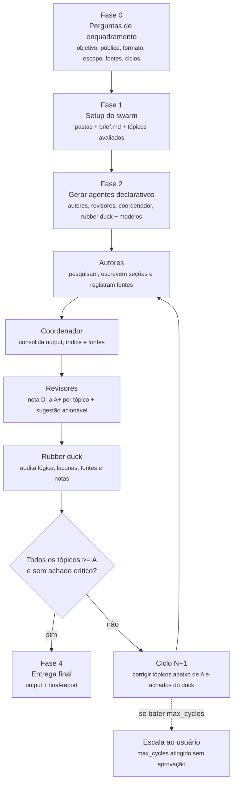

# Document Swarm 🐝

[](https://orcid.org/0009-0006-0765-4201)
[](https://creativecommons.org/licenses/by/4.0/)
[](https://github.com/github/copilot-cli)
[](https://github.com/EdneiMonteiro/document-swarm/commits)

Skill do **Copilot CLI** que monta um **enxame de agentes declarativos** (autores,
revisores, coordenador e rubber duck) para produzir um documento de alta
qualidade sobre **qualquer tema**, em **ciclos de melhoria iterativa** até que
**todos os tópicos avaliados atinjam nota mínima A**. Ao enumerar os agentes, a
skill também escolhe e registra o melhor modelo para cada um.

> Skill (fonte da verdade): `SKILL.md` (na raiz deste repo)
> Saída dos swarms: por padrão `<clone>\swarms\<YYYY-MM-DD>-SWARM-<XX>\`
> (configurável — ver [Instalação](#instalação) e [Local de saída](#local-de-saída))

> ⚠️ Repositório de uso pessoal/profissional, fornecido **no estado em que se
> encontra**. Veja [DISCLAIMER.md](./DISCLAIMER.md) e [SUPPORT.md](./SUPPORT.md).

---

## Instalação

A skill é distribuída como este repositório. Para instalar em qualquer máquina:

```bash
# Linux/macOS
git clone <url-deste-repo> ~/Projects/document-swarm
cd ~/Projects/document-swarm
./scripts/install.sh
```

```powershell
# Windows (PowerShell)
git clone <url-deste-repo> $HOME\Projects\document-swarm
cd $HOME\Projects\document-swarm
pwsh scripts\install.ps1
```

O instalador cria o symlink `~/.copilot/skills/document-swarm` → raiz deste repo,
para o Copilot CLI reconhecer a skill (confirme com `/skills` após reiniciar).

> **Windows:** o symlink exige **Developer Mode** habilitado (Settings → Privacy &
> security → For developers) ou terminal elevado; sem isso, o instalador cai
> automaticamente para *junction*.

### Local de saída

A skill **não** tem caminho de saída fixo. O `<OUTPUT_ROOT>` é resolvido em runtime:

1. **Destino explícito** que você indicar no pedido (uma pasta, drive, ou até um
   repositório separado só para o produto de saída).
2. **Variável de ambiente `DOCSWARM_ROOT`**, se definida.
3. **Default:** `<clone>\swarms`, onde `<clone>` é a pasta onde este repo foi
   clonado (resolvida pelo alvo real do symlink da skill).

As entregas em `swarms/` **não** são versionadas (estão no `.gitignore`) — são o
produto local de cada execução, não parte da distribuição da skill.

---

## 1. O que é

Quando você pede "implemente um documento sobre X", a skill não escreve sozinha.
Ela **decompõe o trabalho em papéis especializados**, materializa cada papel como
um arquivo `.md` (agente declarativo), e roda um **ciclo de produção e revisão**
inspirado em uma redação editorial:

1. **Pergunta** o que precisa saber sobre o tema (enquadramento).
2. **Identifica os perfis de autor** necessários para cobrir o assunto.
3. **Identifica os perfis de revisão** (dimensões de qualidade).
4. **Escolhe o melhor modelo para cada agente** e registra a justificativa.
5. **Gera todos os agentes** como `.md` declarativos.
6. O **coordenador** roda os autores → monta o documento → roda os revisores.
7. Revisores dão **nota D‑ a A+ por tópico** + sugestão de melhoria.
8. O coordenador **devolve aos autores** as melhorias e repete o ciclo.
9. Um **rubber duck** revisa o trabalho de todos a cada ciclo.
10. Encerra quando **todos os tópicos ficam ≥ A** (ou escala ao usuário).

A premissa central: **qualidade vem de especialização + revisão iterativa com
régua dura + evidência verificável**, não de uma única passada.

---

## 2. Quando dispara (triggers)

Use frases como:

- "implemente um documento sobre `<tema>`"
- "crie/escreva um documento sobre `<tema>`"
- "monte um swarm para escrever sobre `<tema>`"
- "preciso de um documento completo sobre `<tema>`"
- "swarm de documentação sobre `<tema>`"
- "quero um whitepaper/relatório/guia técnico sobre `<tema>`"

**Não dispara** para texto curto (um parágrafo, um e‑mail). O swarm é para
entregas substanciais que se beneficiam de múltiplas especialidades e revisão.

---

## 3. Os quatro tipos de agente

Todo agente é um arquivo `.md` autocontido com **frontmatter YAML** (metadados) +
corpo (persona, missão, como trabalhar, padrão de qualidade). O `.md` **é** a
especificação do agente; a execução despacha esse `.md` como prompt de um
subagente (`task`, tipo `general-purpose`).

O frontmatter também declara o modelo escolhido para aquele agente
(`model`, `reasoning_effort`, `context_tier` quando aplicável) e uma
`model_rationale` curta. A decisão consolidada fica em
`reports\agent-models.md`.

| Agente | Quantos | Papel |
|---|---|---|
| **Autor** | 3–6 | Escreve as seções/tópicos sob sua especialidade. |
| **Revisor** | 3–5 | Avalia uma **dimensão** de qualidade, nota por tópico. |
| **Coordenador** | 1 | Orquestra o loop, aplica o portão A, mantém rastreio. |
| **Rubber Duck** | 1 | Revisor transversal de TODOS (autores, revisores, coord). |

### 3.1 Autores
Perfis complementares que, juntos, cobrem o tema com profundidade. Exemplo para
"Zero Trust no Azure": Arquiteto de Identidade, Engenheiro de Rede, Especialista
em Compliance, Redator Técnico. Cada autor pesquisa, escreve sua parte direto em
`output\`, e registra fontes.

### 3.2 Revisores (dimensões de qualidade)
Base sugerida (ajustável ao tema):

- **Precisão técnica** — fatos, exatidão, ausência de erros.
- **Estrutura & clareza** — organização, fluência, didática.
- **Completude & escopo** — nada faltando, nada fora do escopo.
- **Aderência ao público** — nível, tom, utilidade prática.
- **Fontes & evidências** — ≥5 fontes funcionais, citação correta, atualidade.

### 3.3 Coordenador
É você (a CLI executando a skill). Roda o loop, consolida o documento, aplica o
portão (≥ A), garante rastreabilidade e a regra de fontes, e escala ao usuário se
bater o teto de ciclos.

### 3.4 Rubber Duck
Revisor transversal. Caça o que cada agente sozinho não vê: erros de lógica,
contradições entre seções, vieses, lacunas de escopo, **notas mal calibradas** e
**fontes que não sustentam as afirmações**. Um achado **Crítico** força novo
ciclo mesmo com todos os tópicos em A.

### 3.5 Seleção de modelo por agente

Ao enumerar os agentes, a skill escolhe o melhor modelo para cada papel em vez de
usar um padrão único para todos. A escolha considera: complexidade de raciocínio,
volume de contexto, risco técnico/regulatório, necessidade editorial e diversidade
entre autores, revisores e rubber duck. Revisores críticos e rubber duck devem,
quando possível, usar uma família de modelo diferente dos autores principais para
reduzir cegueira coletiva.

---

## 4. Régua de notas e portão de qualidade

Da pior para a melhor:

```text
D-  D  D+   C-  C  C+   B-  B  B+   A-  A  A+
```

- **Portão de aprovação:** cada tópico avaliado precisa de **A** ou **A+**.
- **A‑ NÃO passa** — exige mais um ciclo de melhoria naquele tópico.
- Toda nota vem com: (a) justificativa curta, (b) **sugestão de melhoria
  acionável** (o que mudar, não só "melhore").

Calibração de referência: **A/A+** = pronto para publicar nessa dimensão; **B** =
bom com lacunas; **C** = retrabalho sério; **D** = inadequado.

---

## 5. Regra de fontes (vale para TODO agente)

- **Mínimo 5 fontes online distintas e funcionais** por agente (autores e
  revisores).
- Prioridade: **documentação oficial** > **normas/padrões** > **artigos
  acadêmicos** > **blogs de referência reconhecidos**.
- **Verifique cada URL** com `web_fetch` (e/ou `web_search` para localizar) e
  registre o status (ex.: `HTTP 200 em 2026-06-29`). **Nunca** cite uma URL sem
  abri-la. Caiu → troque por outra funcional.
- Autores registram fontes ao fim da seção e em `sources\sources-index.md`.
- Revisores **conferem** as fontes (contagem, funcionamento, e se realmente
  sustentam as afirmações). Fonte fraca derruba a nota do tópico "Fontes &
  evidências".
- Evite conteúdo gerado por IA sem autoria e fóruns não confiáveis.

---

## 6. Estrutura de saída

Tudo em `<OUTPUT_ROOT>` (ver [Local de saída](#local-de-saída)). Cada pedido ganha
uma subpasta `<YYYY-MM-DD>-SWARM-<XX>` (`XX` sequencial **por dia**: `01`, `02`,
...; escolha o próximo número livre da data antes de criar).

```text
<OUTPUT_ROOT>\<YYYY-MM-DD>-SWARM-<XX>\
├─ brief.md                      # tema + respostas das perguntas + tópicos avaliados
├─ agents\
│  ├─ coordinator.md             # agente coordenador
│  ├─ rubber-duck.md             # agente rubber duck (revisor transversal)
│  ├─ authors\
│  │  ├─ author-01-<slug>.md     # um por perfil de autor
│  │  └─ author-02-<slug>.md
│  └─ reviewers\
│     ├─ reviewer-01-<slug>.md   # um por perfil de revisor
│     └─ reviewer-02-<slug>.md
├─ reports\
│  ├─ agent-models.md            # agente, modelo escolhido e justificativa
│  ├─ cycle-01-authors.md        # o que cada autor entregou no ciclo
│  ├─ cycle-01-review.md         # notas D- a A+ por tópico + sugestões
│  ├─ cycle-01-rubberduck.md     # achados do rubber duck
│  ├─ cycle-02-review.md         # ...
│  └─ final-report.md            # resumo: ciclos, notas finais, fontes
├─ sources\
│  └─ sources-index.md           # consolidado de todas as fontes verificadas
└─ output\
   └─ <documento-final>.md       # a entrega
```

---

## 7. Fluxo de execução (fases)

### Fase 0 — Perguntas de enquadramento (obrigatória)
Via `ask_user`, antes de gerar qualquer agente. Cobrir no mínimo: **objetivo**,
**público-alvo**, **formato/tipo**, **profundidade/extensão**, **idioma**
(PT‑BR padrão), **escopo incluído/excluído**, **restrições**, **fontes
preferenciais/proibidas**, **critérios de sucesso**, **prazo** e **nº máximo de
ciclos** (padrão 5). Sem resposta → padrão sensato registrado no `brief.md`.

### Fase 1 — Setup da pasta
1. `swarm_id = <YYYY-MM-DD>-SWARM-<XX>` (próximo `XX` livre do dia).
2. Cria a árvore completa de pastas.
3. Escreve `brief.md` com tema, respostas e a **lista de "tópicos de
   importância"** (os itens que o portão A exige).

### Fase 2 — Perfis e geração dos agentes
1. Identifica **3–6 autores** complementares, escolhe o modelo de cada um e gera
   `.md` em `agents\authors\`.
2. Identifica **3–5 revisores** (dimensões), escolhe o modelo de cada um e gera
   `.md` em `agents\reviewers\`.
3. Escolhe o modelo de coordenação e gera `agents\coordinator.md`.
4. Escolhe o modelo do rubber duck e gera `agents\rubber-duck.md`.
5. Registra a matriz completa em `reports\agent-models.md`.

### Fase 3 — Loop de produção (você é o Coordenador)
Por ciclo `N`:
1. **Despacha autores** (subagentes em paralelo quando independentes) usando o
   modelo declarado no frontmatter, com o `.md` do autor + `brief.md` + tópicos
   dele + (ciclo ≥ 2) sugestões dos revisores. Eles escrevem em `output\`.
2. **Consolida** `output\<doc>.md` + `reports\cycle-0N-authors.md`.
3. **Despacha revisores** usando os modelos declarados → notas D‑…A+ por tópico +
   sugestões → `reports\cycle-0N-review.md` (matriz tópico × revisor + nota
   mínima).
4. **Despacha rubber duck** usando o modelo declarado →
   `reports\cycle-0N-rubberduck.md`. Achado crítico vira melhoria obrigatória.
5. **Portão:** todos os tópicos ≥ A **e** sem achado crítico → Fase 4. Senão,
   `N+1` e volta ao passo 1 só com os tópicos < A + achados do rubber duck.
6. **Trava:** ao bater `max_cycles` sem aprovar tudo, **para e escala ao
   usuário** (não entrega < A em silêncio).

### Fase 4 — Entrega
1. Finaliza `output\<documento-final>.md` (índice + bibliografia).
2. Escreve `reports\final-report.md` (ciclos, matriz final ≥ A, nº de fontes,
   perfis e modelos usados).
3. Responde ao usuário com caminhos + resumo curto.

---

## 8. Diagrama do ciclo



---

## 9. Templates dos agentes

Os templates completos vivem na skill (`SKILL.md`, na raiz deste repo). Resumo do
frontmatter de cada tipo:

**Autor**
```yaml
name: author-<XX>-<slug>
kind: author
role: <Perfil>
model: <modelo escolhido>
reasoning_effort: <se suportado pelo modelo>
context_tier: <default|long_context>
model_rationale: "<por que este modelo é o melhor para este autor>"
swarm: <swarm_id>
sources_min: 5
```

**Revisor**
```yaml
name: reviewer-<XX>-<slug>
kind: reviewer
role: <Dimensão>
model: <modelo escolhido>
reasoning_effort: <se suportado pelo modelo>
context_tier: <default|long_context>
model_rationale: "<por que este modelo é o melhor para este revisor>"
swarm: <swarm_id>
sources_min: 5
scale: "D- D D+ C- C C+ B- B B+ A- A A+"
gate: "A"
```

**Coordenador**
```yaml
name: coordinator
kind: coordinator
model: <modelo escolhido>
reasoning_effort: <se suportado pelo modelo>
context_tier: <default|long_context>
model_rationale: "<por que este modelo é o melhor para coordenação>"
swarm: <swarm_id>
gate: "A"
max_cycles: 5
```

**Rubber Duck**
```yaml
name: rubber-duck
kind: rubber-duck
model: <modelo escolhido>
reasoning_effort: <se suportado pelo modelo>
context_tier: <default|long_context>
model_rationale: "<por que este modelo é o melhor para auditoria transversal>"
swarm: <swarm_id>
```

Corpo de **Autor**: Persona · Missão · Tópicos sob responsabilidade · Como
trabalhar · Tabela de fontes (≥5, verificadas) · Padrão de qualidade.

Corpo de **Revisor**: Persona · Missão · Como avaliar · **Saída**: tabela
`Tópico | Nota | Justificativa | Sugestão acionável` + nota mínima + tópicos que
bloqueiam o portão + fontes próprias.

Corpo de **Coordenador**: Missão · Loop por ciclo (6 passos) · Regras (não diluir
a régua; exigir ≥5 fontes; manter rastreio).

Corpo de **Rubber Duck**: Missão · O que checar (autores, revisores,
coordenador) · Saída: achados priorizados (Crítico/Importante/Menor) + veredito.

---

## 10. Exemplo (ilustrativo)

> 📒 **Estudo de caso real (ponta a ponta):** veja
> [`docs/examples/coe-nuvem.md`](./docs/examples/coe-nuvem.md) — um playbook de
> **CoE de Nuvem** criado do zero e depois **evoluído** com assessment de
> maturidade e diagramas Mermaid (Modo Evolução / Fase E).

Pedido: *"implemente um documento sobre arquitetura Zero Trust no Azure para um
público de arquitetos de segurança"*.

- **Tópicos de importância:** Visão geral · Identidade · Rede · Dispositivos ·
  Dados · Monitoramento · Custos · Trade‑offs · Referências.
- **Autores:** Arquiteto de Identidade · Engenheiro de Rede · Especialista em
  Compliance · Redator Técnico.
- **Revisores:** Precisão técnica · Estrutura & clareza · Completude & escopo ·
  Aderência ao público · Fontes & evidências.
- **Ciclo 1:** "Rede" recebe **B‑**, "Custos" recebe **C+** → devolvido aos
  autores com sugestões concretas.
- **Ciclo 2:** "Rede" sobe para **A**, "Custos" para **A‑** (ainda bloqueia).
- **Ciclo 3:** "Custos" → **A**. Rubber duck sem achado crítico → **entrega**.

---

## 11. Salvaguardas e antipadrões

- **Nunca diluir a régua** para "fechar" o documento. A barra é **A**.
- **Nunca inventar fatos ou fontes.** Faltou dado → diga o que falta, não fabule.
- **Sempre verificar URLs** antes de citar (HTTP 200).
- **Não entregar < A em silêncio.** Bateu `max_cycles` → escala ao usuário com os
  tópicos teimosos e o porquê.
- **Rubber duck pode reabrir** o ciclo mesmo com tudo em A, se houver achado
  crítico (contradição, fonte furada, nota inflada).
- **Rastreabilidade total** em `reports\` e `sources\`.

---

## 12. Referências de arquivos

| Item | Caminho |
|---|---|
| Skill (fonte da verdade) | `SKILL.md` (raiz deste repo) |
| Instaladores | `scripts\install.ps1` · `scripts\install.sh` |
| Saída dos swarms | `<OUTPUT_ROOT>\<YYYY-MM-DD>-SWARM-<XX>\` (default `<clone>\swarms`) |
| Esta documentação | `README.md` (raiz deste repo) |
| Estudo de caso (CoE de Nuvem) | `docs\examples\coe-nuvem.md` |

---

## 13. Checklist de entrega (resumo)

- [ ] Pasta do swarm criada com a árvore completa.
- [ ] `brief.md` com perguntas respondidas e tópicos de importância.
- [ ] 3–6 autores + 3–5 revisores + coordenador + rubber duck, todos `.md`, cada
      um com modelo escolhido e justificativa.
- [ ] `reports\agent-models.md` com agente, papel, modelo, esforço/contexto e
      justificativa.
- [ ] Ciclos registrados em `reports\` (authors, review, rubberduck por ciclo).
- [ ] **Todos** os tópicos com nota final **≥ A** (ou escalonado).
- [ ] Cada agente com **≥ 5 fontes verificadas (HTTP 200)** em
      `sources\sources-index.md`.
- [ ] Documento final em `output\` com índice e bibliografia.
- [ ] `reports\final-report.md` escrito.
