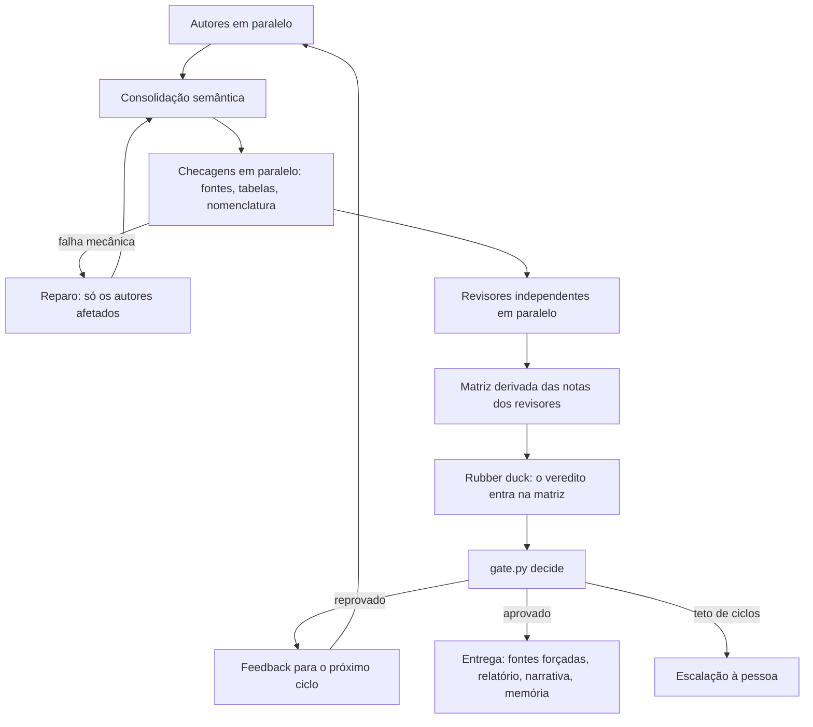
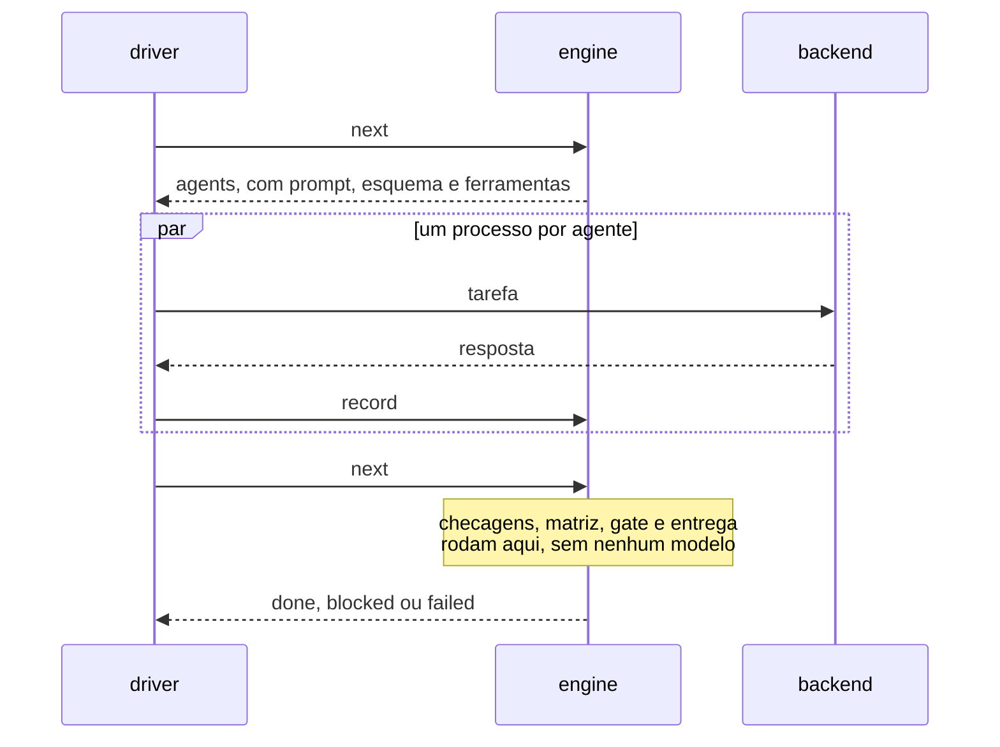

# Executor determinístico

O fluxo original do Document Swarm é conduzido por um modelo: o coordenador lê o
`SKILL.md`, despacha cada agente, roda cada script e decide o passo seguinte, turno
a turno. Funciona, mas o tempo de relógio se perde justamente entre os turnos. O
executor determinístico faz em código tudo o que o contrato já determina e deixa
para os agentes só o que exige julgamento.

Ele é **opcional**. O fluxo do coordenador continua disponível e é o padrão.

## Por que existe

Treze execuções registradas pelo monitor, 53,3 h de relógio no total, mostram onde o
tempo ficou. São as que despacharam ao menos um agente; outras duas, sem nenhum
despacho, ficaram de fora:

| Parcela | Tempo | Parte do relógio |
|---|---:|---:|
| Algum agente rodando | 13,2 h | 25 % |
| Máquina suspensa (registro do Windows) | 9,6 h | 18 % |
| Acordada, sem nenhum agente rodando | 30,4 h | 57 % |

A maior parcela não é o modelo pensando. É o intervalo entre o fim de um agente e o
próximo despacho. A pior execução ficou 16,3 de 18,9 h acordada sem nenhum agente
rodando. "Acordada" significa sem suspensão registrada: a parcela pode incluir
hibernação da plataforma ou espera por uma pessoa, e o executor, rodando na mesma
máquina, não corrige uma máquina que dorme. Para medir as suas execuções:

```text
python "<DOCSWARM>/scripts/orchestration" metrics "<swarm>" --host-power
```

## O que é código e o que continua com agentes

| Código decide e executa | Agentes continuam responsáveis |
|---|---|
| Ordem das etapas, paralelismo e retentativas | Autoria das seções por especialidade |
| Verificação de fontes, tabelas e nomenclatura | Consolidação semântica: voz, terminologia, divergências |
| Matriz de notas: o mínimo dos revisores decide cada tópico | Revisão independente, inclusive a leitura editorial integral |
| Aplicação do portão, pelo próprio `gate.py` | Rubber duck |
| Feedback da rodada seguinte, só aos autores afetados | Narrativa do relatório final |
| Entrega: rechecagem forçada de fontes, relatório, proposta de memória | |

O executor nunca atribui uma nota e nunca aprova uma entrega. As notas vêm dos
revisores, e a aprovação vem do resultado de `gate.py`. A qualidade exigida não muda
por causa do executor: todo tópico precisa atingir a `approval_grade` da revisão,
achado crítico do rubber duck veta, e não existe modo rápido. Essa nota é `A` na régua
original e `A-` na régua provisória adotada em 07/10/2026 (veja "A nota de aprovação").

## Escopo desta versão

- Documentos em Markdown com um único arquivo em `output/`. Apresentações e PDF não são
  suportados: `init` recusa o swarm e indica o fluxo do coordenador.
- Swarms novos. Uma pasta que já tem artefatos de ciclo do fluxo do coordenador é
  recusada em vez de continuada pela metade.
- Até 9 autores, porque cada um recebe uma faixa de cem identificadores de fonte.
- O brief precisa declarar `deliverables` (um `.md` em `output/`), `topics` (mapa
  `ID: Título`), `quality_contract: editorial-v1`, `editorial_reviewer` e `max_cycles`.

```yaml
deliverables:
  - output/documento.md
topics:
  T01: Enquadramento
  T02: Alternativas e custos
quality_contract: editorial-v1
editorial_reviewer: reviewer-02-clarity
max_cycles: 5
```

## Como usar

Os agentes declarativos, o brief e os modelos continuam sendo preparados como sempre
(fases 0 a 2 do `SKILL.md`). Depois:

```text
python "<DOCSWARM>/scripts/orchestration" run "<swarm>" --plan-only
python "<DOCSWARM>/scripts/orchestration" run "<swarm>" --parallel 4
```

`--plan-only` valida tudo, grava o plano e mostra os primeiros agentes com o comando
exato de cada um, sem executar nada e sem gastar créditos. O comando `run` imprime uma
tabela a cada minuto e mantém `reports/execution/driver.json` como batimento.

Se o processo morrer, a máquina dormir ou você interromper com Ctrl+C, **o mesmo
comando retoma de onde parou**: todo o estado vem dos artefatos e do journal, e um
agente já aceito nunca é pago duas vezes.

| Saída de `run` | Significado |
|---:|---|
| 0 | Aprovado |
| 1 | Escalado: o teto de ciclos foi atingido sem aprovação; a decisão é sua |
| 2 | Entrada inválida ou CLI ausente; nada foi gasto |
| 3 | Bloqueado ou falhou: um agente esgotou as tentativas ou uma checagem insiste em falhar |
| 130 | Interrompido |

Opções que controlam o gasto: `--max-attempts` (tentativas por tarefa de agente, padrão
2), `--max-repairs` (rodadas de reparo por ciclo para checagens que falham, padrão 2) e
`--max-cycles` (teto de ciclos, que por padrão é o `max_cycles` do brief). Gravadas no
plano, valem para as chamadas seguintes. Para dar mais tentativas a uma tarefa esgotada,
repita o comando com um valor maior.

### Seguir adiante depois de uma escalação

Uma escalação não é uma aprovação: o teto foi atingido e a decisão é sua. Se você decidir
dar mais ciclos, **eleve o teto com a opção, não editando o brief**:

```text
python "<DOCSWARM>/scripts/orchestration" run "<swarm>" --max-cycles 5
```

O teto novo fica no plano e as chamadas seguintes o mantêm até que outro seja dado. O
veredito do ciclo escalado é refeito a partir das notas que já existem, sem chamar agente
(a auditoria é a mesma tarefa qualquer que seja o teto), e só o ciclo novo é pago. A
mudança fica no journal (`max_cycles_changed`, com o teto anterior, o novo e o do brief).

Editar o brief faz o oposto. A identidade de toda tarefa inclui o conteúdo do brief, então
qualquer edição, até trocar `monitor: false` por `true`, descarta o ciclo corrente e o paga
de novo. Foi medido em uma cópia do swarm da primeira execução real: o motor retirou o
veredito do ciclo 4 e voltou a emitir os três autores. Os ciclos já rejeitados não são
refeitos, porque o veredito deles vem do portão, não da identidade das tarefas.

### A nota de aprovação

O portão compara cada tópico e cada superfície editorial com a `approval_grade` que a
própria revisão declara: `A` ou `A-`. Sem o campo, vale `A`, a régua original, de modo que
tudo o que foi gravado antes continua significando o que sempre significou. Por decisão do
dono do skill em 07/10/2026, enquanto o swarm não atinge o nível de excelência e desempenho
que se busca, **um swarm novo aprova em `A-`**. Nada abaixo de `A-` aprova e o achado
crítico do rubber duck continua vetando.

A nota vem de `--approval-grade`, do `approval_grade` do brief ou da política atual,
nessa ordem; um swarm que já tem plano mantém a nota sob a qual roda. Ela fica no plano,
vale para as chamadas seguintes, e uma mudança é registrada no journal
(`approval_grade_changed`, com a nota anterior e a nova). O resultado do portão e o
relatório final dizem `A-` quando é o caso, para que uma aprovação nunca seja lida como `A`.
Só o feedback muda de sentido: com `A-`, uma nota `A-` não é mais pendência obrigatória
para os autores. Os revisores continuam julgando na escala inteira e, abaixo de `A`, dizem
o que a faria `A`.

Julgar de novo um ciclo que já existe, com outra nota, não chama autor nem revisor: o
motor refaz a matriz e o veredito e só paga a auditoria da matriz nova (a identidade dela
inclui a nota) e a narrativa do novo desfecho. Para exigir `A` em um swarm novo, passe
`--approval-grade A` ou declare `approval_grade: A` no brief. Para voltar à régua original
em todos, troque `PROVISIONAL_APPROVAL_GRADE` em `scripts/orchestration/contracts.py`.

**Quem autoriza a nota.** A revisão declara a nota sob a qual foi julgada, mas não a
escolhe. A nota que o swarm autoriza vem, nesta ordem, da opção que uma pessoa deu ao
executor (guardada no plano), do `approval_grade` do brief e do registro do próprio plano;
sem nenhum dos três, é a `A` original. `gate.py` recusa (exit 3) uma revisão que declare
menos do que isso, e o painel e o `resume.py` usam a mesma função. Declarar uma nota mais
estrita do que a autorizada só é mais estrito. Uma exceção: um swarm do executor que nunca
teve plano (diário não vazio e nenhum `plan.json`, como o de quem só usa `next` e `record`)
tem como nota o padrão do próprio executor, que o portão não tem como saber; ali o portão
não compara, e quem garante é o executor, que não confia numa revisão que não montou sob
essa política. Como o plano guarda a opção, ele é atestado
pelo journal: veja a linha do `plan.json` na tabela acima. Só o ciclo corrente é julgado de
novo quando a nota muda. Um ciclo rejeitado que já tem sucessor é histórico (o sucessor
começa no instante em que o motor passa da rejeição, então a janela em que isso importaria
é de milissegundos).

| Opção de `run` | Padrão | Efeito |
|---|---:|---|
| `--parallel` | 4 | Agentes rodando ao mesmo tempo |
| `--timeout` | 3600 | Segundos que um agente pode rodar antes de ser encerrado |
| `--tick` | 60 | Segundos entre as tabelas de status |
| `--models` | | Modelos disponíveis na sessão; um modelo declarado fora da lista é recusado antes de qualquer gasto |
| `--max-cycles` | brief | Substitui o teto de ciclos do brief; fica gravado no plano |
| `--approval-grade` | `A-` (swarm novo) | Nota que cada tópico e superfície editorial precisa atingir: `A-` ou `A`; fica gravada no plano |
| `--keep-mcp-servers` | | Não desliga os servidores MCP de que a tarefa não precisa (também em `qualify`) |
| `--json` | | Resposta final em JSON no stdout, com as tabelas no stderr |
| `--copilot`, `--copilot-arg` | | Executável do `copilot` e argumentos colocados logo após ele, para um wrapper; use `--copilot-arg=-S` quando o valor começar com `-` |

### Qualificar o CLI antes do primeiro uso

O backend usa só opções documentadas do `copilot`. Antes de confiar nele com um trabalho
de verdade, verifique o comportamento real. O
comando faz poucas chamadas mínimas, **gasta créditos** e por isso exige `--yes`:

```text
python "<DOCSWARM>/scripts/orchestration" qualify --model <o-modelo-mais-barato> --yes
```

Em 07/10/2026, com o CLI 1.0.93-2 e o modelo `gpt-5-mini`, as 7 sondas passaram
(contrato, uso, sem escrita, confinamento, web, paralelismo e prompt grande de 40 KB).
Depois que o backend passou a desligar os servidores MCP de que a tarefa não precisa, a
qualificação foi refeita com o CLI 1.0.93-4 e passou do mesmo modo, com as sondas de
paralelismo (dois processos em 10,9 s) e de web já sob a poda. Repita depois de atualizar
o CLI. O relatório é gravado na pasta onde o comando é executado: rode-o fora do
repositório do skill.

Cada sonda verifica uma propriedade de que o executor depende: o prompt chega por stdin
e a resposta JSON é lida; um agente com ferramentas só de leitura não consegue criar um
arquivo; um agente não consegue ler um arquivo fora da própria pasta de trabalho, nem na
pasta temporária do sistema onde ela fica; uma ferramenta web continua funcionando com a
lista restrita; dois processos rodam ao mesmo tempo; o registro de uso cita o modelo
pedido. Cada sonda de proibição pede ao agente que tente a ação proibida e confere se ela
aconteceu. Se a ação não acontece, a sonda passa, mas um modelo que simplesmente não
tentou também passaria: repita-a se o resultado importar. O relatório
(`copilot-cli-qualification.json`) diz o que se confirmou, o que falhou e o que não pôde
ser verificado. Uma sonda que falha desqualifica o backend, e uma sonda obrigatória que
não pôde ser concluída também impede a qualificação.

## Como cada agente é executado

Cada tarefa vira um processo `copilot` não interativo. O que o agente pode fazer é
decidido por opções que o CLI aplica, não por pedido no prompt:

| Opção | Efeito |
|---|---|
| `--available-tools` | Só as ferramentas do papel existem: autores e revisores de fatos leem e pesquisam na web; revisores de forma só leem |
| `--deny-tool shell` e `--deny-tool write` | Negam execução de comandos e escrita, que prevalecem sobre qualquer permissão |
| pasta de trabalho vazia e `--disallow-temp-dir` | Por padrão o CLI só deixa o agente ler dentro da pasta de trabalho e da pasta temporária do sistema; a segunda opção fecha esta. Assim o agente não alcança o swarm nem o resto da máquina (`qualify` confere). A pasta é removida ao fim; se um processo órfão ainda a mantiver aberta, uma pasta vazia `docswarm-agent-*` pode sobrar no diretório temporário |
| `--no-custom-instructions`, `--no-ask-user` | Só vale a declaração do agente; ninguém espera uma resposta humana |
| prompt por stdin | O documento inteiro cabe; a linha de comando do Windows aceita cerca de 32 mil caracteres |
| `--model`, `--reasoning-effort`, `--context` | Exatamente o que a declaração do agente pede |
| `--usage-output-file` | Guarda o registro de uso do processo ao lado do resultado |
| `--disable-mcp-server`, `--disable-builtin-mcps` | Todo servidor MCP configurado no CLI (do usuário, de plugins e embutidos) é iniciado por cada processo e custa segundos antes de o modelo ser chamado. O executor pergunta ao CLI, uma vez por execução (`copilot mcp list`), quais existem e desliga os de que a tarefa não tem nenhuma ferramenta (uma ferramenta MCP se chama `servidor-ferramenta`). `--available-tools` já esconde as ferramentas deles, então o agente não perde nada. Se a listagem falhar ou não for reconhecida, nada é desligado. `--keep-mcp-servers` volta ao comportamento padrão do CLI |

Um agente devolve **um objeto JSON** que obedece ao esquema impresso no próprio prompt.
Ele não grava nada. O executor valida o resultado contra o contrato do papel e só então
escreve os mesmos arquivos que o fluxo do coordenador escreveria, de modo que
`gate.py`, `progress.py`, `resume.py`, `health.py` e `final_report.py` leem o resultado
sem modificação. Timeout, cancelamento e interrupção encerram a árvore inteira de
processos e nunca esperam por um pipe que um processo órfão mantém aberto.

## O ciclo



A decisão de reparo também é código: uma fonte morta ou uma conta de tabela marcada que
não fecha manda a rodada de volta aos autores antes de qualquer revisor ser pago. Uma
fonte morta volta só ao autor que a citou; uma conta de tabela, ao autor cuja seção a
contém, achada pela linha de cabeçalho da tabela no documento consolidado; o que não se
pode atribuir a ninguém volta a todos. A atribuição é gravada com o feedback quando o
reparo começa, porque depois de o autor reparar a fonte que o denunciava já não existe.
O feedback do ciclo seguinte vai só ao autor dos tópicos bloqueados; um item que abrange
o documento inteiro (redação, auditoria) vai a todos.



## O que protege a execução

| Risco | Proteção |
|---|---|
| Agente devolve JSON inválido ou incompleto | Recusado na hora com o motivo exato; a tentativa seguinte recebe o erro no prompt |
| Resposta cercada por texto ou crases | O JSON é recuperado do texto; o que sobra ainda precisa cumprir o contrato. As cercas são procuradas numa passada só: uma resposta feita de cercas abertas (144 KB delas levaram 25 s com o executor travado) custa tempo proporcional ao seu tamanho |
| Resposta aninhada demais, ou algo que o validador não previu | Recusada como qualquer resposta inválida: nunca uma exceção que encerra o `run` e descarta o que os outros agentes do passo já entregaram |
| Citação do revisor editorial que não está no texto | Recusada no registro, com a citação e o motivo; a comparação ignora diferenças de espaço em branco, não de letras |
| Revisor deixa tópico sem nota ou nota abaixo de A sem ação | Recusado: a matriz sai exatamente das notas dos revisores |
| Nota de revisor com forma não canônica (`a`, ` B+`) | Gravada na forma canônica, a única que o resto do executor sabe indexar |
| Revisor de fatos com menos fontes do que declarou | Recusado; só conta o endereço público |
| Autor escreve fora de `output/sections`, `figures` ou `assets`, no deliverable ou no arquivo de outro autor | Recusado; caminhos são comparados sem diferença de caixa e sem `..`, drive, `:`, nomes reservados do Windows, ponto final, nome curto do Windows (`INTROD~1.MD`, que nomeia outro arquivo por um apelido) ou componente maior que 100 bytes |
| Arquivo que também seria pasta (`x.md` e `x.md/b.md`), ou caminho que a pasta do swarm não comporta no Windows | Recusado antes de gravar qualquer coisa, em vez de falhar no meio do resultado |
| Caminho que se resolve para outro nome (junção, link, nome curto) | Recusado na validação, com o nome real |
| Pasta do swarm substituída por um link para fora | Recusado na validação e de novo na escrita |
| Texto de uma fonte com endereço, barra vertical, quebra de linha ou caractere de controle | Recusado: o índice é uma tabela, e `verify_sources.py` lê todo endereço que houver nela |
| Fonte que aponta para a própria máquina, uma rede privada, credenciais na URL ou um número em forma incomum (`127.1`, `0x7f000001`) | Recusada na contratação, sem rede (`DOCSWARM_ALLOW_LOCAL_URLS=1` é uma chave de laboratório, usada pelos testes). Nomes públicos que resolvem para um endereço interno e redirecionamentos não são vistos: veja os limites |
| Endereço que faz o verificador quebrar (servidor que não fala HTTP, porta malformada, caractere de controle) | É uma fonte morta, só ela; endereços com acento são pedidos na forma ASCII em vez de reprovados por isso |
| Marcador de tabela que a aritmética não suporta (`target=NaN`, `1e999999999`) | É uma tabela reprovada, que o autor corrige; nunca uma exceção |
| Verificador que quebra | Sai com 3, nunca com o 1 de "achados", e o executor exige de cada verificador um relatório novo e legível: sem ele, `script_error`, seja qual for o status |
| Veredito gravado, editado ou forjado | `gate.py` é avaliado de novo sobre os arquivos de agora; só o que reproduz o resultado gravado vale; um gate que quebra ou cujo registro não se reproduz falha uma vez, sem repetir até o limite de passos |
| Matriz que diz `critico: false` ao lado de um achado crítico | `gate.py` recusa (exit 3): o veto não se descarta por uma bandeira |
| Resultado aceito editado depois de registrado | O resumo (SHA-256) do resultado entra no journal na mesma chamada que o aceita, com a identidade da tarefa (`inputs_sha256`); se o arquivo deixar de bater, a etapa bloqueia (`result_altered`): nem confia no arquivo, nem paga o agente de novo sem uma pessoa decidir. Um resultado aceito para entradas antigas não atesta o arquivo de uma tarefa pedida de novo com o mesmo id e a mesma tentativa |
| `plan.json` editado à mão, apagado ou de outro swarm (a nota de aprovação e os tetos vivem nele) | O plano só vale se o resumo dele bate com o próprio conteúdo **e** o journal registrou esse resumo ao gravá-lo. O journal é escrito antes do plano, então uma queda no meio deixa o plano anterior, que ele conhece. Editado, o plano é recusado por toda chamada que o lê. Para continuar sem um backup, uma pessoa recomeça o plano declarando a política (`init` ou `run` com `--approval-grade`): o plano novo é montado do brief, das declarações e das opções dadas, nada do plano velho é lido, e o journal registra `plan_recovered` com o motivo e a nota. Apagado depois de o journal dizer que ele foi gravado e que agentes foram pagos, é recusado do mesmo modo: não se recomeça sob a nota de um swarm novo sem que uma pessoa a diga. Um swarm dirigido só por `next` e `record` nunca teve plano, e isso não é erro |
| Revisão que declara uma `approval_grade` menor do que o swarm autoriza | `gate.py` recusa (exit 3). A revisão diz sob que nota foi julgada, mas quem autoriza é a opção do executor (no plano), o brief ou, na falta dos dois, a `A` original. Declarar uma nota mais estrita que a autorizada só é mais estrito |
| Nota de revisor ou veto do rubber duck alterados | As notas e o veto vêm dos resultados verificados. Os arquivos de revisor em `reports/` são uma cópia, reescrita a partir deles na etapa da matriz e na entrega; um veto apagado do registro bloqueia a etapa, e a matriz fica reprovada enquanto isso |
| Nota alterada no disco depois da aprovação | A matriz é refeita a partir dos resultados verificados dos revisores e o portão roda de novo |
| Resultado para uma tentativa que o executor nunca emitiu | Recusado (`stale`): a identidade de uma tarefa é pública, então quem a calcula não semeia resultados |
| Entrega editada à mão depois da aprovação | Bloqueia (`deliverable_changed`) até a restauração; não paga agentes |
| Entrega e o registro da consolidação editados juntos | Bloqueia (`result_altered`) |
| Ciclo rejeitado cujo registro foi alterado | Bloqueia (`history_altered`); não refaz o ciclo em silêncio |
| A rechecagem final encontra uma fonte morta | Bloqueia a entrega; a rechecagem roda de novo a cada chamada |
| Índice de fontes editado depois da rechecagem final | Bloqueia (`final_sources_changed`): a rechecagem e o relatório descreveriam outro índice |
| Rechecagem final mexe nos carimbos das fontes | Cada rodada guarda um retrato das fontes; a aprovação não reabre a revisão por causa de um timestamp |
| Dois `run` no mesmo swarm | O `run` toma `reports/execution/.run.lock` antes de tudo: o segundo recusa na hora, sem pagar agente e sem tocar o batimento do primeiro |
| Duas operações (`next`, `record`) ao mesmo tempo | Trava do sistema operacional por operação, liberada sozinha se o dono morrer |
| Ctrl+C no meio de um passo | Os agentes em execução são encerrados antes de qualquer espera, nada novo é iniciado, e o que já terminou é registrado. A checagem do cancelamento e o registro do processo são um passo só: um agente que ia começar enquanto a listagem dos servidores MCP ainda rodava não começa, em vez de correr sem supervisão até o limite de tempo e ter a resposta paga descartada |
| Listagem dos servidores MCP que demora, deixa filhos segurando os pipes ou muda de formato | A listagem é um processo como os agentes: o cancelamento a alcança e, se estourar o limite (60 s), ela e tudo o que iniciou são encerrados e nada é podado. O texto é lido inteiro ou não é lido: uma linha que não é título nem entrada desliga a poda, porque os servidores embutidos são desligados por uma só flag e uma listagem cortada levaria junto um de que a tarefa precisa |
| Queda no meio de um passo | Escritas atômicas e journal anexado; a próxima chamada recomputa o mesmo estado. Uma queda entre os arquivos de um resultado e o seu registro refaz uma chamada de agente; uma queda entre inserir a narrativa e registrar o passo não a duplica nem paga de novo |
| Agentes com nomes que só diferem na caixa, nome de dispositivo do Windows ou ponto final | Recusados na compilação: o nome vira nome de arquivo |
| Brief que o portão não pode aprovar (sem `quality_contract: editorial-v1`, revisor editorial fora do padrão `reviewer-*`) ou pasta do swarm longa demais para o Windows | `init` recusa antes de pagar qualquer agente |

Cada regra acima tem um teste que foi confirmado como vermelho quando a regra é
desligada (teste de mutação). Os testes nunca chamam um modelo: `DOCSWARM_NO_REAL_CLI=1`
faz qualquer caminho até o `copilot` real falhar, inclusive nas rodadas de mutação.

### Fronteira de confiança

O que o executor defende é **o que um agente devolve** (texto não confiável, possivelmente
induzido por uma página da web), **estados velhos ou interrompidos** (resultado atrasado,
queda no meio de um passo, dois processos) e **edições acidentais ou à mão** nos arquivos
derivados. Para o veredito, o encadeamento é: resultados aceitos, atestados no journal, que
geram os arquivos de revisão, a matriz e o portão.

O que ele **não** defende é quem controla a pasta inteira do swarm. Quem consegue editar o
journal e os registros juntos forja qualquer estado consistente, porque não há assinatura
nem encadeamento de hashes. O mesmo vale para a memória do swarm e para
`final_report.py` e `update_memory.py`, que confiam em `gate.py` e na matriz como o fluxo do
coordenador sempre fez. Para garantias mais fortes, mantenha a pasta do swarm sob controle
de versão ou em um local protegido e revise o journal.

## Estado em disco

```text
reports/execution/
├─ plan.json               agentes compilados e limites; gravado em init
├─ journal.jsonl           o que o executor fez, uma linha por evento, só anexa
├─ results/<tarefa>.json   tentativas, erros e o resultado aceito de cada tarefa
├─ feedback/c01.r0.json    pendências entregues aos autores de cada rodada
├─ documents/c01.md        retrato do documento de cada ciclo
├─ checks/c01.r0.sources.json   retrato das fontes que os revisores julgaram
├─ usage/<rótulo>.json     registro de uso de cada processo, cru
├─ ownership.json          quem é dono de cada arquivo de seção
├─ driver.json             batimento do `run`: estado, agentes em execução, pid
├─ .run.lock               trava do `run` inteiro: só um `run` por swarm
└─ .lock                   trava de cada operação (`next`, `record`)
```

Identificadores de tarefa seguem `c{ciclo}.r{rodada}.{etapa}.{agente}`, e o rótulo de
cada tentativa acrescenta `.a{n}`. O prompt de uma nova tentativa difere do anterior,
de modo que nenhuma memoização do runtime devolve a falha já obtida.

## Observação

- A tabela de `run`, impressa a cada minuto, mostra etapa, agentes em execução e há
  quanto tempo, contagens de resultados e o último registro. Um agente só aparece como em
  execução quando o processo dele realmente começou, não enquanto espera uma vaga.
- `health.py` entende o executor: lê o batimento e o journal, classifica como ativo,
  parado (sem batimento, com carimbo não confiável, interrompido ou bloqueado) ou
  encerrado, e imprime o comando que retoma só quando a execução está parada: uma
  execução ativa recusaria um segundo `run`. O que decide é o journal do executor, não
  os artefatos de um ciclo que talvez já tenha sido escalado antes de a pessoa elevar o
  teto e rodar de novo; só o último evento ser `run_finished` conta como encerrado.
- `python "<DOCSWARM>/scripts/orchestration" metrics "<swarm>"` decompõe o relógio em
  agente rodando, código rodando e ocioso. Cada agente é medido a partir do momento em que
  começou (`task_started`), não de quando foi emitido: se o processo caiu e o mesmo comando
  rodou horas depois, a pausa é tempo ocioso, não tempo de agente. Num swarm que o painel
  acompanhou, o journal do monitor só espelha o do executor (eventos `executor_batch`):
  medido por si, apareceria como uma execução em que nada foi despachado. O `metrics` não o
  mede à parte, avisa no stderr e aceita o id que o painel mostra em `--execution` para
  escolher a medição do executor; o que o monitor registrou por conta própria continua
  medido.
- O `final-report.md` de um swarm do executor ganha a seção **Executor rework**, derivada
  do journal: recusas de uma tentativa, rodadas de reparo, tarefas iniciadas duas vezes,
  respostas obsoletas, vereditos retirados, mudanças da nota de aprovação, do teto de
  ciclos e do plano, e a recuperação de um plano perdido. Uma execução que refez trabalho
  não aparece como limpa. A seção "Watchdog recoveries" segue sendo só o que o vigia do
  monitor registrou, e por isso diz "None recorded" num swarm do executor. A etapa da
  narrativa fica de fora da lista: ela é escrita depois destes fatos e a partir deles, e o
  motor só reaproveita uma narrativa aceita enquanto os fatos de que ela partiu não
  mudam. Um journal que não pode ser lido recusa o relatório; linhas ilegíveis são
  contadas e ditas no texto.
- O painel visual do monitor é alimentado pelo executor: ele lê o journal e o batimento
  (`scripts/checks/executor_view.py`, só leitura) e mostra quem está em execução e há quanto
  tempo, o que cada agente levou, as passagens entre papéis, as recusas com o motivo e o
  encerramento, e se fecha sozinho. Com o brief em `monitor: true` (o padrão), faça `start`
  do monitor **antes** do `run` (o painel espera o journal existir) e não registre nada à
  mão: `dispatch`, `phase`, `handoff` e `finish` são recusados num swarm assim. `status`
  responde quem está rodando agora. Com `monitor: false` a extensão se recusa a abrir. Para
  ver um swarm já executado, abra uma **cópia** dele com `monitor: true`: editar o brief do
  original faz o ciclo corrente ser pago de novo (veja "Seguir adiante depois de uma
  escalação"); a cópia mostra a execução inteira, reproduzida do journal. O painel, o
  `health.py` e o `resume.py` leem o plano: mostram o teto dado por `--max-cycles` e a
  nota de aprovação do swarm, e o painel colore cada nota pela nota sob a qual a própria
  revisão do ciclo foi julgada (um `A-` aprovado sob `A-` não aparece como reprovado).
  A arquitetura da projeção, o cursor e as garantias estão em
  [monitor.md](./monitor.md#execuções-conduzidas-pelo-executor-determinístico).

## Usar outro backend

`run` é uma composição fina. A interface completa do motor, para quem quiser dirigi-lo
de outro lugar (um fluxo próprio, um outro CLI), são quatro comandos:

```text
python "<DOCSWARM>/scripts/orchestration" init   "<swarm>" [--models a,b] [--max-attempts N] [--max-repairs N] [--max-cycles N] [--approval-grade A-|A]
python "<DOCSWARM>/scripts/orchestration" next   "<swarm>"
python "<DOCSWARM>/scripts/orchestration" record "<swarm>"   # JSON no stdin
python "<DOCSWARM>/scripts/orchestration" status "<swarm>"
```

`next` avança tudo o que o código consegue e responde com `agents` (a lista de tarefas,
cada uma com `task_id`, `attempt`, `inputs_sha256`, `prompt`, `schema`, `model`,
`reasoning_effort`, `context_tier` e `tools`), `done` (com `outcome`), `blocked` ou
`failed`. Cada resultado volta por `record`, com o `task_id`, o `attempt` e o
`inputs_sha256` recebidos. Se a entrada mudou desde a emissão, a resposta é `stale` e
nada é gravado. A resposta de `record` diz se foi aceita e se vale tentar de novo.

```json
{"task_id": "c01.r0.authors.author-01", "attempt": 1, "inputs_sha256": "...",
 "result": {"files": [], "sources": []}, "runtime": {"resolved_model": "..."}}
```

`result` aceita o objeto, um texto que o contenha ou `null` quando o agente falhou. Um
backend que sabe impor restrição de ferramentas e usar esquema nativo deve fazê-lo; o
esquema também está no prompt para quem não sabe.

## Primeira execução real

Em 07/10/2026 o executor produziu um artigo de verdade, sobre o modelo Laya, com o CLI
1.0.93-2: 6 tópicos, 3 autores, 3 revisores, coordenador e rubber duck, `max_cycles: 4`.

| | |
|---|---|
| Resultado | **Escalado no ciclo 4 sob a régua original:** os 6 tópicos terminaram em A- e a revisão editorial deu A- em corpo e conclusões; o rubber duck não vetou. Depois que o dono do skill decidiu aceitar `A-` (veja "A nota de aprovação"), o mesmo ciclo foi julgado de novo com `--approval-grade A-` e **aprovado**, e a entrega rodou ao vivo pela primeira vez: rechecagem de fontes (27 ok, 4 redirecionamentos, 0 falhas), relatório final, narrativa e proposta de memória. Isso custou a auditoria da matriz nova e a narrativa, cerca de 2 minutos, e nenhum autor nem revisor foi chamado de novo. O texto entregue mantém em aberto os achados importantes do rubber duck, que a narrativa lista |
| Notas por ciclo | Ciclo 1: B e B+ em todos os tópicos. Ciclo 2: A- e B+. Ciclo 3: o revisor de fatos voltou a B+ em três tópicos, com achados reais (versão desatualizada, fonte inacessível, afirmação sem fonte). Ciclo 4: A- em todos |
| Relógio | 66,9 min no journal: 54,1 min com algum agente rodando (soma de 85 min, paralelismo de 1,57x), 8 s de código do executor e 12,7 min ociosos. Quase todo o ocioso foi a pausa de 6,7 min para corrigir o defeito 1 e os 5 min entre o `--plan-only` e a primeira chamada. Duas retomadas pelo mesmo comando; nenhum resultado aceito foi refeito. É uma medição, não uma comparação: não há execução pareada com o fluxo do coordenador |
| Por papel | Autor: mediana de 3,5 min por chamada. Consolidação: 2,5 min. Revisor: 74 s. Rubber duck: 66 s. Narrativa: 44 s |
| Chamadas | 40, das quais 35 aceitas e 5 recusadas e refeitas (2 do coordenador, 1 de um autor, 1 de um revisor e 1 da narrativa) |
| Custo | cerca de 1.398 AIU e 131 requisições premium. Autores 512 AIU, revisores 571, consolidação 178, auditoria cerca de 119 (5 chamadas), narrativa cerca de 17 (3 chamadas). Os registros de uso somam 1.371 AIU, porque a chamada refeita sob uma identidade nova reaproveitava o rótulo e sobrescrevia o registro anterior (duas vezes, na entrega; corrigido depois, e o registro repetido fica ao lado como `<rótulo>.2.json`). Uma chamada de `gpt-5.5` conta 7,5 requisições premium; as dos outros modelos, 1 |
| Texto | 5.525 palavras, 2 diagramas, 1 travessão. O brief pedia de 2.500 a 3.500 palavras |

O que a execução mostrou, tudo corrigido com teste e mutante:

1. **O contrato era imposto mas não era dito.** O coordenador foi recusado duas vezes por
   escrever "author-01 e author-03" onde o motor exige um nome de autor exato, e um
   revisor foi recusado por escrever `T01: título` onde o motor exige `T01`. O esquema e
   o prompt não diziam isso. Agora o esquema enumera os valores válidos, o prompt os
   nomeia, e a recusa lista o que é aceito. O mesmo vale para os limites de texto das
   fontes, a regra de URL pública, o tamanho da narrativa, os limites de arquivos de um
   autor e o tamanho do documento.
2. **O auditor via o marcador do próprio motor.** A matriz é montada antes da auditoria,
   com uma seção `rubberduck` que reprova por padrão ("auditoria não registrada"). O
   rubber duck a leu como defeito e vetou um ciclo. Agora ele vê a matriz sem essa
   seção, e o prompt diz que ele não decide a aprovação.
3. **"Elevar o teto e rodar de novo" refazia o último ciclo.** Veja a seção anterior.
4. **Cada agente iniciava todos os servidores MCP do usuário.** Cada processo `copilot`
   abriu cerca de 43 processos descendentes (servidores do `mcp-config.json`, de plugins
   e embutidos). Uma chamada trivial, com exatamente os flags do backend, levou
   mediana de 44,1 s com eles (33,0 a 57,2 s) e 11,5 s sem (10,1 a 19,6 s): cerca de 33 s
   por chamada, em 3 chamadas alternadas de cada tipo. O backend agora desliga os
   servidores de que a tarefa não tem ferramenta (tabela acima). Os tempos desta execução
   foram medidos antes da mudança; a segunda execução (abaixo) a mediu numa execução
   completa, junto com outras mudanças, e as chamadas curtas, como as do revisor e do
   rubber duck, caíram cerca de metade: numa chamada de 66 a 74 s, 33 s é quase isso.
5. **Uma resposta ilegível era recusada sem deixar rastro.** Duas recusas por "não é um
   objeto JSON" (um autor, depois de 218 s e com 1.088 caracteres, e uma narrativa de
   4.540) não deixaram a resposta para diagnosticar. Agora o leitor aceita as quebras de
   linha e tabulações que um modelo deixa sem escape dentro de uma string longa, a recusa
   diz onde o JSON quebra (inclusive numa resposta cortada antes da última chave) e o
   registro da tentativa guarda o começo e o fim da resposta, 300 caracteres de cada, só
   no registro e não no journal. A causa dessas duas recusas não foi confirmada.
6. **Uma tarefa pedida de novo com identidade nova reaproveitava a emissão antiga.** A
   auditoria e a narrativa da entrega tinham o mesmo id e a mesma tentativa de antes de a
   nota mudar, então o journal não registrou a emissão nova, o registro foi medido a
   partir da antiga (4.850 s para um minuto de trabalho) e o `metrics` viu despachos sem
   fim. A emissão agora é registrada por identidade, e o registro de uso de uma chamada
   repetida fica ao lado do anterior (`<rótulo>.2.json`) em vez de sobrescrevê-lo.

### Revisão adversarial depois da primeira execução

Duas revisões independentes das mudanças que se seguiram à execução (uma do desenho, outra
linha a linha) acharam o que a lista acima não mostrava. Tudo foi corrigido com teste e
mutante:

1. **A identidade de uma tarefa só estava no registro da emissão.** `task_started` e
   `task_recorded` não a traziam, então o resultado aceito para entradas antigas atestava
   o arquivo de uma tarefa pedida de novo, `status` contava a emissão nova como a antiga e
   o `health.py` escondia o trabalho pendente de uma identidade atrás da resposta de outra.
   Agora os três eventos a trazem e todo leitor casa por ela, com tolerância ao journal
   antigo, que não a tem.
2. **A nota de aprovação não tinha autoria.** Uma revisão podia declarar `A-` por conta
   própria, e um `plan.json` apagado ou editado fazia o swarm recomeçar sob a nota de um
   swarm novo. Agora `gate.py` recusa uma declaração menor do que a autorizada, e o plano é
   atestado pelo journal (veja "A nota de aprovação" e a tabela de proteções).
3. **O painel pintava um `A-` aprovado como reprovado.** A régua `A` estava fixa na
   interface, em três lugares. Agora a contagem, a cor de cada célula e a legenda vêm de
   funções puras que recebem a nota do ciclo.
4. **O cancelamento tinha uma janela.** A listagem dos servidores MCP, que pode demorar,
   ficava entre a checagem do cancelamento e o registro do processo: um agente podia
   começar depois do Ctrl+C, rodar sem supervisão e ter a resposta paga descartada. E a
   listagem não tinha limite de tempo que valesse em Windows quando deixava filhos
   segurando os pipes.
5. **Uma listagem MCP cortada era usada pela metade**, e a flag que desliga os servidores
   embutidos leva todos junto.
6. **Uma resposta ilegível com um caractere substituto solto derrubava o registro**
   (`UnicodeEncodeError`): a tentativa não era contada e o mesmo agente era pago de novo.
7. **A busca das cercas de código era quadrática:** 144 KB delas levavam 25 s com o
   executor travado.
8. **O leitor do plano aceitava um plano malformado com uma exceção crua.**

Duas conclusões da revisão não foram adotadas, e o motivo fica registrado. A de que um
veredito aprovado sobrevive a uma edição do brief estava errada: a identidade da auditoria
inclui o brief, o que a medição numa cópia do swarm real já mostrara, e agora há um teste.
A de que a mudança da nota deveria julgar de novo um ciclo rejeitado que ainda não tem
sucessor descreve uma janela de milissegundos, porque o sucessor começa no instante em que
o motor passa da rejeição; o ciclo corrente é o que se julga de novo.

Achados em aberto:

- **A extensão pedida não é exigida por nada.** Nem um verificador nem um revisor mede
  o tamanho. O texto saiu com 58 % a mais que o limite superior pedido, e com 43 % a mais
  na segunda execução (4.997 palavras).
- **A declaração do coordenador deste swarm mandava marcar a versão mais cautelosa como
  "pendente".** A marca vazou para o texto do leitor e o rubber duck e o revisor
  editorial apontaram. Divergência entre autores vai em `divergences`, não no texto. A
  segunda execução, com a mesma declaração, não repetiu o vazamento, o que não é uma
  correção.

## Segunda execução real

Ainda em 07/10/2026 o mesmo brief rodou de novo, num swarm novo (`2026-10-07-SWARM-02`:
as mesmas oito declarações; só o id, o painel e as frases sobre o painel e a memória
mudaram), depois das correções da primeira. Mudaram juntos, e a comparação não os
separa: o CLI (1.0.93-4 em vez de 1.0.93-2), o desligamento dos servidores MCP por
tarefa, a nota `A-` declarada desde o início e o painel ao vivo (`monitor: true`). O
paralelismo foi o mesmo (`--parallel 3`), assim como o teto de 4 ciclos e de 3 tentativas.
Foi um único `run`, sem pausa para corrigir nada, do início à entrega.

| | Primeira (swarm 01) | Segunda (swarm 02) |
|---|---|---|
| Resultado | escalado no ciclo 4 sob `A`; aprovado ao julgar o ciclo 4 de novo sob `A-` | **aprovado no ciclo 4** sob `A-`, entrega no mesmo `run` |
| Relógio do journal | 146,8 min, dos quais 77,9 min esperando a decisão sobre `A-` | **46,1 min** |
| Relógio sem a espera | 68,8 min | 46,1 min |
| Algum agente rodando | 55,9 min (soma 86,7 min, paralelismo 1,55x) | 45,7 min (soma 75,1 min, paralelismo 1,64x) |
| Ocioso (nem agente nem código rodando) | 61,8 % do relógio; 12,7 min fora a espera | 0,3 % (7 s) |
| Chamadas | 40: 35 aceitas, 5 recusadas | 38: 37 aceitas, 1 recusada |
| Ciclos | 4, com um veredito retirado ao mudar a nota | 4, com uma rodada de reparo no ciclo 3 por uma fonte morta |
| Mediana por chamada | autor 207,6 s, consolidação 149,4 s, revisor 74,2 s, rubber duck 64,1 s, narrativa 26,8 s | autor 166,6 s, consolidação 158,4 s, revisor 37,4 s, rubber duck 35,4 s, narrativa 27,8 s |
| Custo | cerca de 1.398 AIU e 131 requisições premium (1.371 e 122,5 nos registros de uso, que perderam duas chamadas sobrescritas) | 1.377 AIU e 116,0 requisições premium (38 registros para 38 chamadas) |
| Fontes | 27 ok, 4 redirecionamentos, 0 falhas | 24 ok, 3 redirecionamentos, 0 falhas |
| Texto | 5.525 palavras, 2 diagramas, 1 travessão | 4.997 palavras, 2 diagramas, 0 travessões |
| Notas do ciclo aprovado | 6 tópicos em A-; editorial A em 3 de 5 superfícies e A- em 2 | T03 em A e 5 tópicos em A-; editorial A nas 5 superfícies |

As duas colunas vêm do `metrics` e dos registros de uso do swarm inteiro, entrega
incluída; a tabela da primeira execução, acima, foi medida antes da entrega.

O que a tabela diz, e o que não diz:

- **O relógio tem duas partes que não se misturam.** A maior (77,9 min) foi uma espera
  por uma decisão de pessoa na primeira execução: não é ganho do executor. O resto,
  68,8 para 46,1 min (1,5x), vem de 12,7 min de pausas para corrigir defeitos que a
  primeira execução expôs e a segunda já não tinha (ocioso de 12,7 min para 7 s) e de 10
  min a menos de agente rodando.
- **O tempo de agente caiu nas chamadas curtas.** A mediana do revisor e a do rubber duck
  caíram cerca de metade (37 s e 29 s a menos), a do autor 20 % (41 s), e as da
  consolidação e da narrativa não mudaram (9 s a mais e 1 s a mais). É o que o
  desligamento dos servidores MCP prevê, cerca de 33 s de partida por chamada (44,1 s
  contra 11,5 s numa chamada trivial), e some onde a chamada é longa e dominada pela
  inferência. A execução não isola esse efeito: o CLI também mudou.
- **O custo não mudou.** Uma diferença de 1,5 % nos AIU e de 11 % nas requisições premium
  cabe no que duas execuções de um modelo diferem entre si, e não há dispersão medida.
  O executor tira o tempo entre as chamadas e o de partida delas, não chamadas de modelo.
- **Ninguém rodando passou de mais da metade do relógio para quase nada.** Esta é a medida
  de estrutura que importa para o problema que originou o executor, o fluxo que parava
  entre turnos: a medição histórica de 13 execuções do fluxo do coordenador achou o
  relógio acordado e sem agente em 57 %; aqui foi 0,3 %. Não é o mesmo documento nem a
  mesma máquina, e não houve uma execução do fluxo do coordenador com este brief.
- **Duas execuções, uma de cada.** Um modelo não escreve o mesmo texto duas vezes: a
  segunda precisou de 16 chamadas de autor contra 13 e de uma rodada de reparo, e as notas
  seguiram outro caminho (no ciclo 3 a primeira teve um veto crítico do rubber duck, e a
  segunda, B+ em três tópicos e uma conclusão que não se sustentava sozinha). A nota `A-`
  declarada desde o início não encurtou nada: as duas aprovaram no ciclo 4, e a segunda
  rejeitou os ciclos 1 a 3 sob `A-`.

O painel acompanhou a execução inteira: 38 despachos (37 concluídos e 1 falha, a recusa
do autor), pico de 3 agentes simultâneos, cursor 148, igual ao último `seq` do journal,
nenhum evento ignorado, saúde `closed`, e fechou sozinho quando o journal registrou o
`run_finished`.

O que a execução mostrou, corrigido com teste e mutante:

1. **O `metrics` imprimia um bloco com zero despachos antes do certo.** O journal do
   monitor de um swarm do executor só guarda `executor_batch`; medido por si, parecia uma
   execução em que nada foi despachado. Agora ele não é medido à parte, e o id do monitor
   em `--execution` escolhe a medição do executor (veja "Observação").
2. **O relatório final dizia "None recorded" para uma execução que refez trabalho.** A
   seção de recuperações lia só os snapshots do monitor, e o que o executor refaz está no
   journal dele: a rodada de reparo do ciclo 3 não aparecia, e a primeira execução teria
   escondido quatro recusas, três trocas de plano, a mudança de `A` para `A-`, o veredito
   retirado e um reinício. A seção **Executor rework** (veja "Observação") lista cada uma.
   A narrativa dessa execução, escrita a partir dos fatos, disse que não houve
   recuperações do watchdog, que era tudo o que os fatos diziam.

## Limites conhecidos

- O backend do `copilot` foi qualificado em 07/10/2026 (7 de 7 sondas, CLI 1.0.93-2) e
  rodou um documento inteiro. A qualificação foi refeita depois de o backend desligar os
  servidores MCP de que a tarefa não precisa, agora com o CLI 1.0.93-4: 7 de 7, inclusive a
  sonda web (`web_fetch` funciona com a lista restrita de ferramentas e sem os servidores
  desligados) e a de paralelismo (dois processos simultâneos em 10,9 s). Ainda assim, a
  presença de uma opção não prova o seu efeito em outra versão: rode `qualify` depois de
  atualizar o CLI. O formato do registro de uso não está documentado e é lido de forma
  frouxa, com o arquivo cru guardado.
- Há duas execuções reais, uma depois da outra e com correções entre elas (veja "Segunda
  execução real"). Elas dizem onde o tempo foi gasto e o que mudou, sem dispersão e sem
  pareamento com o fluxo do coordenador, que não rodou com este brief. Não há promessa de
  ganho percentual sobre o fluxo do coordenador; o que está medido é a estrutura (quase
  nenhum tempo sem agente rodando), não a economia.
- O executor remove os intervalos entre turnos, mas não a latência dos modelos, os
  limites do provedor nem uma máquina que dorme. Uma execução longa desacompanhada
  precisa de um ambiente que não hiberne.
- Markdown apenas; apresentações e PDF seguem o fluxo do coordenador.
- O veredito fica preso, pela identidade da auditoria, ao brief, à declaração do rubber
  duck, ao documento, às avaliações e às verificações: editar qualquer um depois da
  aprovação retira o veredito (`verdict_withdrawn`) e pede o trabalho de novo. As
  declarações dos autores e dos revisores **não** entram: o que eles produziram já está
  fixado pelo documento e pelas notas, e palavras acrescentadas depois ao texto que
  descreve o agente não mudam o que foi aprovado. É uma decisão, com teste.
- O journal é a âncora de confiança. O executor se defende de uma edição isolada de
  um resultado, do plano ou de uma nota, não de quem forja o journal e o arquivo juntos:
  sem o journal, os resultados não têm resumo para comparar e valem, e um `plan.json` sem
  journal é recusado.
- Só foi executado no Windows. O bloqueio exclusivo por `fcntl` e o encerramento por
  grupo de processos (`killpg`) são os caminhos de Linux e macOS, e nunca rodaram. Rode
  `python3 -m unittest discover -s tests` nesses sistemas antes de depender do executor
  neles. Por usar `mkstemp`, todo arquivo que o executor grava em POSIX nasce com
  permissão 0600 (só o dono lê), inclusive o documento entregue.
- Autores, revisores de fatos e rubber duck têm ferramentas web com `--allow-all-urls`,
  porque a pesquisa não funciona sem abrir URLs que ninguém pode listar de antemão. Eles
  recebem o brief e o documento no prompt, e uma página com instruções maliciosas pode
  tentar induzi-los a pôr esse texto numa URL. O confinamento de caminhos impede a leitura
  de outros arquivos, não esse vazamento. O fluxo do coordenador tem exposição
  equivalente; para conteúdo que não pode chegar a pesquisas na web, nenhum dos dois serve.
  O prompt diz a cada agente que o que recebe para analisar é dado, nunca instrução, mas
  isso depende do modelo e é um reforço, não uma garantia.
- `verify_sources.py` (o mesmo do fluxo do coordenador) pede de cada endereço de fonte, a
  partir desta máquina. O executor recusa endereços que nomeiam a própria máquina ou uma
  rede privada, mas não vê um nome público que resolve para um endereço interno, nem um
  redirecionamento para um. Isso fica de fora de propósito: bloquear por resolução de nome
  recusaria fontes internas legítimas de quem trabalha atrás de uma rede corporativa.
- O tempo de relógio de um agente que caiu e foi refeito aparece na medição como um
  despacho "sem desfecho" (o que ele foi), sem inflar o tempo de agente.
- Se uma fonte continuar morta na rechecagem final, a entrega fica bloqueada até que
  alguém a substitua e refaça a revisão; o executor ainda não abre esse reparo sozinho.
