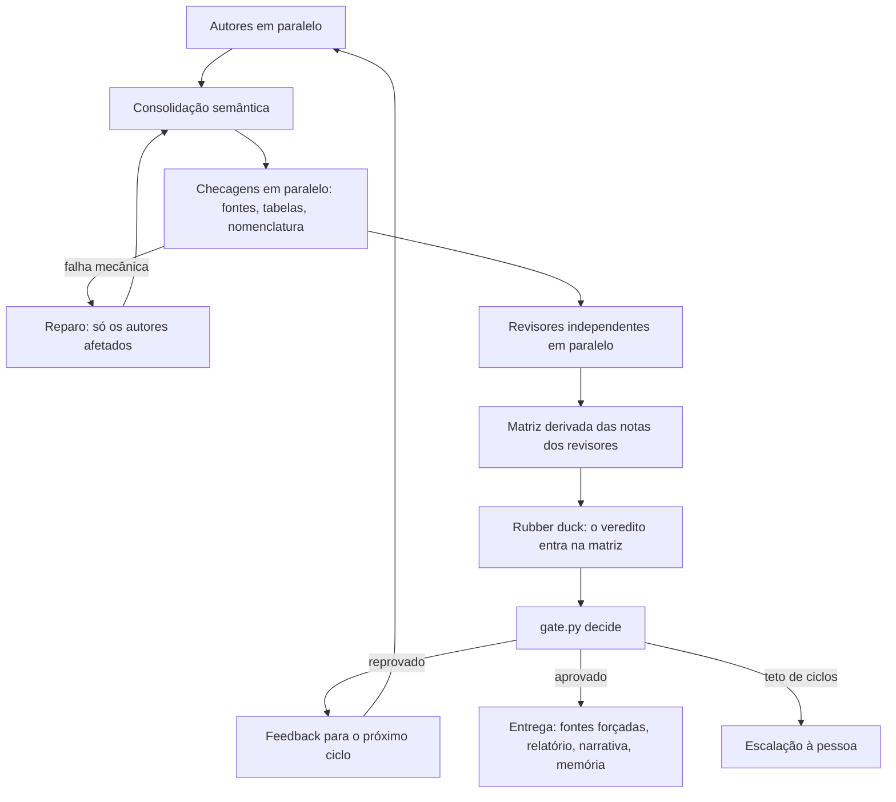
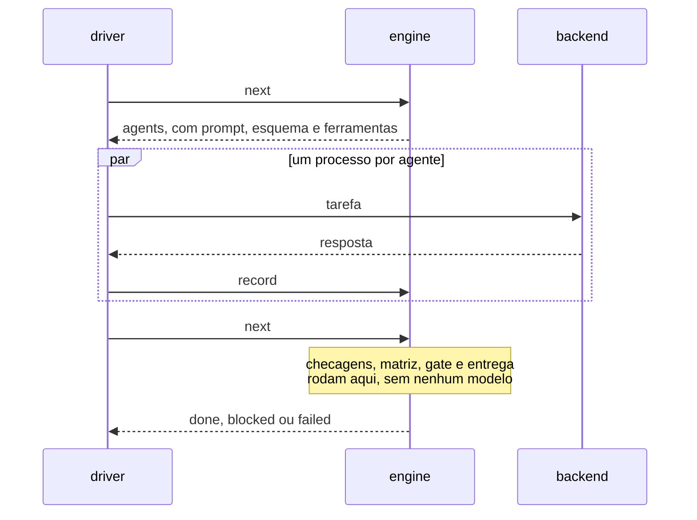

# Executor determinístico

O fluxo original do Document Swarm é conduzido por um modelo: o coordenador lê o
`SKILL.md`, despacha cada agente, roda cada script e decide o passo seguinte, turno
a turno. Funciona, mas o tempo de relógio se perde justamente entre os turnos. O
executor determinístico faz em código tudo o que o contrato já determina e deixa
para os agentes só o que exige julgamento.

Ele é **opcional**. O fluxo do coordenador continua disponível e é o padrão.

## Por que existe

Treze execuções registradas pelo monitor, 53,3 h de relógio no total, mostram onde o
tempo ficou. São as que despacharam ao menos um agente; outras duas, sem nenhum
despacho, ficaram de fora:

| Parcela | Tempo | Parte do relógio |
|---|---:|---:|
| Algum agente rodando | 13,2 h | 25 % |
| Máquina suspensa (registro do Windows) | 9,6 h | 18 % |
| Acordada, sem nenhum agente rodando | 30,4 h | 57 % |

A maior parcela não é o modelo pensando. É o intervalo entre o fim de um agente e o
próximo despacho. A pior execução ficou 16,3 de 18,9 h acordada sem nenhum agente
rodando. "Acordada" significa sem suspensão registrada: a parcela pode incluir
hibernação da plataforma ou espera por uma pessoa, e o executor, rodando na mesma
máquina, não corrige uma máquina que dorme. Para medir as suas execuções:

```text
python "<DOCSWARM>/scripts/orchestration" metrics "<swarm>" --host-power
```

## O que é código e o que continua com agentes

| Código decide e executa | Agentes continuam responsáveis |
|---|---|
| Ordem das etapas, paralelismo e retentativas | Autoria das seções por especialidade |
| Verificação de fontes, tabelas e nomenclatura | Consolidação semântica: voz, terminologia, divergências |
| Matriz de notas: o mínimo dos revisores decide cada tópico | Revisão independente, inclusive a leitura editorial integral |
| Aplicação do portão, pelo próprio `gate.py` | Rubber duck |
| Feedback da rodada seguinte, só aos autores afetados | Narrativa do relatório final |
| Entrega: rechecagem forçada de fontes, relatório, proposta de memória | |

O executor nunca atribui uma nota e nunca aprova uma entrega. As notas vêm dos
revisores, e a aprovação vem do resultado de `gate.py`. A qualidade exigida não muda:
todo tópico precisa de `A` ou `A+`, achado crítico do rubber duck veta, e não existe
modo rápido.

## Escopo desta versão

- Documentos em Markdown com um único arquivo em `output/`. Apresentações e PDF não são
  suportados: `init` recusa o swarm e indica o fluxo do coordenador.
- Swarms novos. Uma pasta que já tem artefatos de ciclo do fluxo do coordenador é
  recusada em vez de continuada pela metade.
- Até 9 autores, porque cada um recebe uma faixa de cem identificadores de fonte.
- O brief precisa declarar `deliverables` (um `.md` em `output/`), `topics` (mapa
  `ID: Título`), `quality_contract: editorial-v1`, `editorial_reviewer` e `max_cycles`.

```yaml
deliverables:
  - output/documento.md
topics:
  T01: Enquadramento
  T02: Alternativas e custos
quality_contract: editorial-v1
editorial_reviewer: reviewer-02-clarity
max_cycles: 5
```

## Como usar

Os agentes declarativos, o brief e os modelos continuam sendo preparados como sempre
(fases 0 a 2 do `SKILL.md`). Depois:

```text
python "<DOCSWARM>/scripts/orchestration" run "<swarm>" --plan-only
python "<DOCSWARM>/scripts/orchestration" run "<swarm>" --parallel 4
```

`--plan-only` valida tudo, grava o plano e mostra os primeiros agentes com o comando
exato de cada um, sem executar nada e sem gastar créditos. O comando `run` imprime uma
tabela a cada minuto e mantém `reports/execution/driver.json` como batimento.

Se o processo morrer, a máquina dormir ou você interromper com Ctrl+C, **o mesmo
comando retoma de onde parou**: todo o estado vem dos artefatos e do journal, e um
agente já aceito nunca é pago duas vezes.

| Saída de `run` | Significado |
|---:|---|
| 0 | Aprovado |
| 1 | Escalado: o teto de ciclos foi atingido sem aprovação; a decisão é sua |
| 2 | Entrada inválida ou CLI ausente; nada foi gasto |
| 3 | Bloqueado ou falhou: um agente esgotou as tentativas ou uma checagem insiste em falhar |
| 130 | Interrompido |

Opções que controlam o gasto: `--max-attempts` (tentativas por tarefa de agente, padrão
2), `--max-repairs` (rodadas de reparo por ciclo para checagens que falham, padrão 2) e
o `max_cycles` do brief. Gravadas no plano, valem para as chamadas seguintes. Para dar
mais tentativas a uma tarefa esgotada, repita o comando com um valor maior.

| Opção de `run` | Padrão | Efeito |
|---|---:|---|
| `--parallel` | 4 | Agentes rodando ao mesmo tempo |
| `--timeout` | 3600 | Segundos que um agente pode rodar antes de ser encerrado |
| `--tick` | 60 | Segundos entre as tabelas de status |
| `--models` | | Modelos disponíveis na sessão; um modelo declarado fora da lista é recusado antes de qualquer gasto |
| `--json` | | Resposta final em JSON no stdout, com as tabelas no stderr |
| `--copilot`, `--copilot-arg` | | Executável do `copilot` e argumentos colocados logo após ele, para um wrapper; use `--copilot-arg=-S` quando o valor começar com `-` |

### Qualificar o CLI antes do primeiro uso

O backend usa só opções documentadas do `copilot`, e foi testado com um CLI substituto.
Antes de confiar nele com um trabalho de verdade, verifique o comportamento real. O
comando faz poucas chamadas mínimas, **gasta créditos** e por isso exige `--yes`:

```text
python "<DOCSWARM>/scripts/orchestration" qualify --model <o-modelo-mais-barato> --yes
```

Cada sonda verifica uma propriedade de que o executor depende: o prompt chega por stdin
e a resposta JSON é lida; um agente com ferramentas só de leitura não consegue criar um
arquivo; uma ferramenta web continua funcionando com a lista restrita; dois processos
rodam ao mesmo tempo; o registro de uso cita o modelo pedido. O relatório
(`copilot-cli-qualification.json`) diz o que se confirmou, o que falhou e o que não pôde
ser verificado. Uma sonda que falha desqualifica o backend.

## Como cada agente é executado

Cada tarefa vira um processo `copilot` não interativo. O que o agente pode fazer é
decidido por opções que o CLI aplica, não por pedido no prompt:

| Opção | Efeito |
|---|---|
| `--available-tools` | Só as ferramentas do papel existem: autores e revisores de fatos leem e pesquisam na web; revisores de forma só leem |
| `--deny-tool shell` e `--deny-tool write` | Negam execução de comandos e escrita, que prevalecem sobre qualquer permissão |
| pasta de trabalho vazia, fora do swarm | O agente não vê o swarm nem o resto da máquina; a pasta é removida ao fim |
| `--no-custom-instructions`, `--no-ask-user` | Só vale a declaração do agente; ninguém espera uma resposta humana |
| prompt por stdin | O documento inteiro cabe; a linha de comando do Windows aceita cerca de 32 mil caracteres |
| `--model`, `--reasoning-effort`, `--context` | Exatamente o que a declaração do agente pede |
| `--usage-output-file` | Guarda o registro de uso do processo ao lado do resultado |

Um agente devolve **um objeto JSON** que obedece ao esquema impresso no próprio prompt.
Ele não grava nada. O executor valida o resultado contra o contrato do papel e só então
escreve os mesmos arquivos que o fluxo do coordenador escreveria, de modo que
`gate.py`, `progress.py`, `resume.py`, `health.py` e `final_report.py` leem o resultado
sem modificação. Timeout, cancelamento e interrupção encerram a árvore inteira de
processos e nunca esperam por um pipe que um processo órfão mantém aberto.

## O ciclo



A decisão de reparo também é código: uma fonte morta ou uma conta de tabela marcada que
não fecha manda a rodada de volta aos autores antes de qualquer revisor ser pago.
O feedback do ciclo seguinte vai só ao autor dos tópicos bloqueados; um item que abrange
o documento inteiro (redação, auditoria, checagem) vai a todos.



## O que protege a execução

| Risco | Proteção |
|---|---|
| Agente devolve JSON inválido ou incompleto | Recusado na hora com o motivo exato; a tentativa seguinte recebe o erro no prompt |
| Resposta cercada por texto ou crases | O JSON é recuperado do texto; o que sobra ainda precisa cumprir o contrato |
| Citação do revisor editorial que não está no texto | Recusada no registro, com a citação e o motivo |
| Revisor deixa tópico sem nota ou nota abaixo de A sem ação | Recusado: a matriz sai exatamente das notas dos revisores |
| Revisor de fatos com menos fontes do que declarou | Recusado |
| Autor escreve fora de `output/sections`, `figures` ou `assets`, no deliverable ou no arquivo de outro autor | Recusado; caminhos são comparados sem diferença de caixa e sem `..`, drive, `:`, nomes reservados do Windows ou ponto final |
| Pasta do swarm substituída por um link para fora | Recusado na validação e de novo na escrita |
| Veredito gravado, editado ou forjado | `gate.py` é avaliado de novo sobre os arquivos de agora; só o que reproduz o resultado gravado vale |
| Nota alterada no disco depois da aprovação | A matriz é refeita a partir dos revisores e o portão roda de novo |
| Entrega editada à mão depois da aprovação | Bloqueia (`deliverable_changed`) até a restauração; não paga agentes |
| Ciclo rejeitado cujo registro foi alterado | Bloqueia (`history_altered`); não refaz o ciclo em silêncio |
| A rechecagem final encontra uma fonte morta | Bloqueia a entrega; a rechecagem roda de novo a cada chamada |
| Rechecagem final mexe nos carimbos das fontes | Cada rodada guarda um retrato das fontes; a aprovação não reabre a revisão por causa de um timestamp |
| Dois processos operando o mesmo swarm | Trava do sistema operacional, liberada sozinha se o dono morrer |
| Queda no meio de um passo | Escritas atômicas e journal anexado; a próxima chamada recomputa o mesmo estado |

Cada regra acima tem um teste que foi confirmado como vermelho quando a regra é
desligada (teste de mutação). Os testes nunca chamam um modelo: `DOCSWARM_NO_REAL_CLI=1`
faz qualquer caminho até o `copilot` real falhar, inclusive nas rodadas de mutação.

## Estado em disco

```text
reports/execution/
├─ plan.json               agentes compilados e limites; gravado em init
├─ journal.jsonl           o que o executor fez, uma linha por evento, só anexa
├─ results/<tarefa>.json   tentativas, erros e o resultado aceito de cada tarefa
├─ feedback/c01.r0.json    pendências entregues aos autores de cada rodada
├─ documents/c01.md        retrato do documento de cada ciclo
├─ checks/c01.r0.sources.json   retrato das fontes que os revisores julgaram
├─ usage/<rótulo>.json     registro de uso de cada processo, cru
├─ ownership.json          quem é dono de cada arquivo de seção
├─ driver.json             batimento do `run`: estado, agentes em execução, pid
└─ .lock                   trava de uso exclusivo
```

Identificadores de tarefa seguem `c{ciclo}.r{rodada}.{etapa}.{agente}`, e o rótulo de
cada tentativa acrescenta `.a{n}`. O prompt de uma nova tentativa difere do anterior,
de modo que nenhuma memoização do runtime devolve a falha já obtida.

## Observação

- A tabela de `run`, impressa a cada minuto, mostra etapa, agentes em execução e há
  quanto tempo, contagens de resultados e o último registro.
- `health.py` entende o executor: lê o batimento e o journal, classifica como ativo,
  parado (sem batimento, interrompido ou bloqueado) ou encerrado, e imprime o comando
  que retoma.
- `python "<DOCSWARM>/scripts/orchestration" metrics "<swarm>"` decompõe o relógio em
  agente rodando, código rodando e ocioso.
- O painel visual do monitor ainda não é alimentado pelo executor. Ele depende dos
  despachos que o coordenador registra, e esta versão não os emite.

## Usar outro backend

`run` é uma composição fina. A interface completa do motor, para quem quiser dirigi-lo
de outro lugar (um fluxo próprio, um outro CLI), são quatro comandos:

```text
python "<DOCSWARM>/scripts/orchestration" init   "<swarm>" [--models a,b] [--max-attempts N] [--max-repairs N]
python "<DOCSWARM>/scripts/orchestration" next   "<swarm>"
python "<DOCSWARM>/scripts/orchestration" record "<swarm>"   # JSON no stdin
python "<DOCSWARM>/scripts/orchestration" status "<swarm>"
```

`next` avança tudo o que o código consegue e responde com `agents` (a lista de tarefas,
cada uma com `task_id`, `attempt`, `inputs_sha256`, `prompt`, `schema`, `model`,
`reasoning_effort`, `context_tier` e `tools`), `done` (com `outcome`), `blocked` ou
`failed`. Cada resultado volta por `record`, com o `task_id`, o `attempt` e o
`inputs_sha256` recebidos. Se a entrada mudou desde a emissão, a resposta é `stale` e
nada é gravado. A resposta de `record` diz se foi aceita e se vale tentar de novo.

```json
{"task_id": "c01.r0.authors.author-01", "attempt": 1, "inputs_sha256": "...",
 "result": {"files": [], "sources": []}, "runtime": {"resolved_model": "..."}}
```

`result` aceita o objeto, um texto que o contenha ou `null` quando o agente falhou. Um
backend que sabe impor restrição de ferramentas e usar esquema nativo deve fazê-lo; o
esquema também está no prompt para quem não sabe.

## Limites conhecidos

- O backend do `copilot` foi construído sobre opções documentadas e testado com um CLI
  substituto, mas ainda não foi qualificado com chamadas reais. Os nomes de ferramenta
  que ele passa (`view`, `glob`, `grep`, `rg`, `web_search`, `web_fetch`) existem na
  tabela do CLI 1.0.93, mas o efeito do filtro só se prova com chamadas reais. Rode
  `qualify` antes de confiar nele; o formato do registro de uso não está documentado e
  é lido de forma frouxa, com o arquivo cru guardado.
- Nenhum benchmark pago foi executado, então não há promessa de ganho percentual. As
  medições acima descrevem onde o tempo foi gasto, não quanto o executor economiza.
- O executor remove os intervalos entre turnos, mas não a latência dos modelos, os
  limites do provedor nem uma máquina que dorme. Uma execução longa desacompanhada
  precisa de um ambiente que não hiberne.
- Markdown apenas; apresentações e PDF seguem o fluxo do coordenador.
- Se uma fonte continuar morta na rechecagem final, a entrega fica bloqueada até que
  alguém a substitua e refaça a revisão; o executor ainda não abre esse reparo sozinho.
