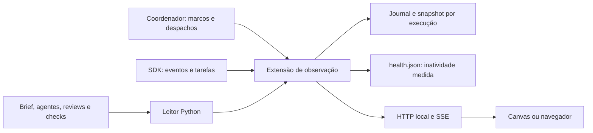
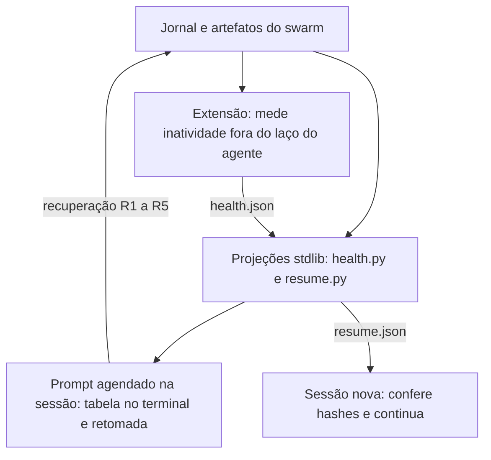

# Monitor visual do Document Swarm

O monitor acompanha a produção de documentos. Ele não executa agentes, não
produz apresentações e não decide a aprovação de uma entrega.

## Instalação e abertura

Os instaladores registram a skill e a extensão pessoal `document-swarm-monitor`.
A extensão usa o SDK fornecido pelo Copilot e um runtime Node.js 20+; os leitores
de artefatos usam Python 3 e biblioteca padrão. Não há instalação npm ou CDN.

Depois da instalação, reinicie o CLI ou solicite a recarga das extensões.
O catálogo deve apresentar a ferramenta `docswarm_monitor` e, quando suportado,
o canvas `document-swarm-monitor`.

O brief usa `monitor: true` por padrão. O coordenador chama `start` após criar a
pasta e o brief, antes de gerar agentes. O painel tenta abrir no canvas e usa o
navegador local como alternativa. A conexão do cliente é observada, não presumida
apenas porque uma URL foi criada.

`-WithoutMonitor` no PowerShell ou `--without-monitor` no Bash instala somente a
skill e remove apenas um link global do monitor pertencente à mesma instalação.
O destino do link nunca é apagado. Diretórios reais e links alheios fazem o
instalador parar antes de modificar os destinos.

A extensão do próprio projeto pode continuar sendo descoberta mesmo sem o link
global. Para não abrir o monitor em uma execução, registre `monitor: false` no
brief ou peça explicitamente uma execução sem monitor.

Dentro de um projeto que também contém `document-swarm-monitor`, a instância
pessoal fica pronta, mas sem registrar ferramentas ou canvases duplicados.
A cópia do projeto é a responsável pelo painel. Fora desses projetos, a cópia
pessoal registra a ferramenta normalmente.

## Painel compacto

O conteúdo usa até **720 × 480 px** por padrão, equivalente a um quarto da área
de uma tela de referência de 1440 × 960. Em hosts menores, adapta-se à área
disponível.

No **canvas nativo do Copilot no Windows**, a abertura ajusta também a área
interna da janela para 720 × 480 pixels lógicos, além do conteúdo. A moldura,
a barra de título e a escala de DPI são medidas, não estimadas. A janela é
identificada pelo PID do host e por um título exclusivo da execução; outras
janelas e abas não são redimensionadas. Uma janela minimizada não é restaurada
automaticamente.

Em abas normais do navegador, canvases incorporados ou outros sistemas, o tamanho
externo permanece sob controle do host. O painel continua compacto; se uma
tentativa de ajuste do canvas Windows não puder ser confirmada, um aviso pede
redimensionamento manual, sem interferir na produção.

Os quatro indicadores ficam em uma faixa curta, sem os antigos cartões altos.
O resultado do gate permanece visível independentemente da aba selecionada.

| Aba | Conteúdo |
|---|---|
| Fluxo | Grafo compacto, fase atual e passagens registradas. |
| Notas | Avaliações por tópico e revisor, fontes, tabelas e bloqueios. |
| Histórico | Eventos da rodada, com origem identificada. |
| Detalhes | Agente ou tópico selecionado e leitura dos artefatos. |

Selecionar um agente ou tópico abre **Detalhes**; o botão de retorno preserva a
origem e o foco. As setas, Home e End permitem navegar pelas abas. Atualizações
do runtime não mudam a aba escolhida.

Use **Execução / rodada** para consultar outro histórico. **Expandir** ocupa a
área oferecida pelo host e **Compactar** restaura o painel reduzido. No canvas
nativo Windows, esses botões ajustam também a janela, limitada à área útil do
monitor em uso. Modelos e
outras informações secundárias continuam em Detalhes, sem comprimir todo o
conteúdo nos cartões do grafo.

## Arquitetura



O adaptador do SDK é isolado do estado e do servidor. A interface recebe uma
projeção do progresso; não acessa o SDK nem oferece endpoints para controlar
agentes. Os eventos são filtrados antes de persistir ou publicar os dados.

A medição de inatividade roda em um temporizador próprio da extensão, não no
laço do agente. É por isso que ela continua medindo quando a sessão para.

## Registro da execução

Exemplo de início:

```json
{"operation":"start","swarm_path":"<caminho absoluto do swarm>"}
```

Use o `execution_id` retornado nas operações seguintes. Para voltar a uma
execução registrada, informe também seu ID no início. Execuções encerradas ou
pertencentes a outra sessão são abertas como histórico, sem retomar agentes.

| Operação | Responsabilidade |
|---|---|
| `start` | Abre a observação da pasta selecionada e tenta apresentar a interface. |
| `phase` | Registra uma fase e um ciclo realmente iniciados pelo coordenador. |
| `dispatch` | Reserva a correlação de um trabalho; retorna `task_name`. |
| `handoff` | Registra uma passagem efetiva entre nomes de agentes declarados. |
| `refresh` | Relê artefatos da execução ativa. |
| `finish` | Solicita encerramento da observação; a confirmação depende de `session.idle`, sem aprovar ou cancelar agentes. |
| `open` | Reabre o painel; `surface: "browser"` solicita o navegador. |
| `status` | Retorna um resumo do monitor e sua condição de conexão. |

Antes de chamar a ferramenta real `task`:

```json
{"operation":"dispatch","execution_id":"<id>","agent_id":"author-01","cycle":1}
```

Passe exatamente o `task_name` retornado no parâmetro `name` de `task`. O ID
declarado do agente continua sendo `author-01`. Para continuar o mesmo trabalho
em um agente já observado, forneça seu `task_id` em outro despacho e depois use
a ferramenta real `write_agent`. A extensão não faz essas chamadas por você.

O monitor distingue registro de intenção, evento nativo, leitura de artefatos
e marco do coordenador. Não associa tarefas por nomes aproximados.

## Estados e qualidade

| Informação | Significado |
|---|---|
| Declarado | A declaração do agente existe; não comprova execução. |
| Aguardando | O despacho foi registrado, mas ainda não há início observado. |
| Executando | O runtime informou execução daquele trabalho. |
| Disponível (idle) | O agente está entre turnos. Esse estado, sozinho, não exige uma resposta do usuário e não aprova conteúdo. |
| Concluído | O trabalho observado terminou; não equivale a documento aprovado. |
| Falhou / cancelado | Resultados distintos de sucesso, preservados na observação. |
| Não observado | A informação está ausente ou não é mais atual. |

O SDK pode reportar cancelamento dentro de um evento de conclusão. A extensão
verifica essa distinção e mantém disponibilidade da tarefa separada do resultado
do trabalho. Modelos solicitados e observados também são identificados; Auto não
recebe uma identidade inventada.

A atividade do agente principal aparece separadamente como **Sessão processando**
ou **Principal entre etapas**. Quando observada, ela também informa o cartão do
coordenador. Assim, subagentes disponíveis podem coexistir com uma sessão ainda
trabalhando. Conclusão de uma chamada ao modelo (`assistant.turn_end`) não é
tratada como conclusão da tarefa.

Agentes reutilizados podem emitir apenas novos turnos e mudanças de estado da
tarefa, sem repetir `subagent.completed`. A correlação usa identidade da tarefa,
chamada original e início observado do novo trabalho. Eventos atrasados da
rodada anterior não encerram um follow-up ainda aguardando execução.

Depois de `finish`, o monitor permanece em **encerramento solicitado** e continua
observando. `session.task_complete` registra a declaração do assistente;
`session.idle` confirma que não há agentes ou comandos anexados em andamento.
Só então a nova execução vira um registro encerrado. Registros antigos mantêm
o significado original e são apresentados como histórico, sem afirmar atividade
atual ou reconstruir sinais que não foram coletados.

As notas individuais vêm de `reports/cycle-NN-reviewer-<id>.json`. O consolidado
continua em `cycle-NN-review.yaml`. O mínimo, nunca a média, determina a nota
efetiva. Inconsistências ficam visíveis e precisam ser corrigidas nos artefatos.

No contrato editorial da versão 3.2, um bloqueio de redação também reprova o
gate, mesmo com as notas técnicas por tópico em A. Se o texto ou algum arquivo
de entrega mudar após a avaliação, o monitor sinaliza o resultado corrente como
desatualizado. As rodadas anteriores continuam como histórico. O formato está
no [guia da revisão editorial](./editorial-review.md).

Relatórios `cycle-NN-nomenclature.json`, quando produzidos, aparecem entre os
artefatos da rodada para consulta. Listam candidatos lexicais; não atribuem
nota nem aprovam siglas, códigos ou legendas.

Registre a execução do portão:

```powershell
python .\scripts\checks\gate.py <review.yaml> --output <cycle-NN-gate.json>
```

O registro contém o resultado, o código de saída e o hash dos bytes avaliados.
Revisão alterada invalida a correspondência. Recalcular uma nota no leitor não é
prova de que o gate foi executado. Gate, fontes, tabelas e encerramento da entrega
aparecem como fatos separados.

Arquivos antigos sem notas individuais ou resultado persistido exibem essa
limitação. O monitor não reescreve o histórico nem confere aprovação retroativa.
Consultar outro ciclo não transporta suas notas para o ciclo atual.

## Saúde da execução e retomada

A extensão é um processo Node separado do laço do agente. Ela mede continuamente
há quanto tempo não há observação nova e publica o resultado em três lugares: no
campo `health` da operação `status`, no painel e em
`reports/progress/<execution_id>/health.json`, reescrito a cada poucos segundos.



A seta de recuperação é a única que escreve: ela redespacha um agente ou executa
um check que faltou. Nenhuma das outras altera o swarm.

A idade da observação decide o estado; o rótulo da sessão apenas explica. Um laço
travado continua reportando `processing` indefinidamente, então confiar no rótulo
é exatamente como uma parada permanece invisível.

| Estado | Critério medido |
|---|---|
| `active` | Sessão processando e observação dentro do limiar |
| `waiting` | Despacho em curso ou fila, dentro do limiar |
| `stalled` | Sem observação além do limiar e sem agente executando, ou além do triplo do limiar em qualquer caso |
| `closed` | Encerramento registrado |
| `unobserved` | Conexão perdida ou observação anterior desatualizada |

O limiar padrão é 180 segundos. Um agente realmente executando ganha folga até o
triplo do limiar, porque uma chamada longa ao modelo pode ficar silenciosa; além
disso, silêncio é parada.

Dois scripts stdlib leem esses registros sem modificar nada:

```powershell
python .\scripts\checks\health.py <pasta-do-swarm> --threshold 180
python .\scripts\checks\resume.py <pasta-do-swarm> --output reports\resume.json
python .\scripts\checks\resume.py <pasta-do-swarm> --check reports\resume.json
```

`health.py` compõe a tabela do terminal a partir dos artefatos, da projeção de
retomada e do `health.json`. Quando a extensão parou de publicar, o arquivo é
descartado e a resposta volta a se basear na idade dos artefatos, dizendo isso em
vez de repetir um número antigo. Sem observação, a linha diz "não observado";
nunca um valor plausível.

`resume.py` projeta o próximo passo determinístico do contrato do ciclo e grava
`reports/resume.json` com os hashes que sustentam a projeção. Em uma sessão nova,
`--check` sai `1` quando algum artefato mudou, e a projeção é recalculada em vez
de ser confiada.

Cada recuperação executada pelo vigia é registrada com
`{"operation":"recovery","rule":"R1".."R5","agent_id":...,"cycle":N,"detail":...}`.
A extensão aplica os tetos: duas por agente por ciclo e seis por execução. Passar
do teto é um erro explícito, não um registro silencioso. As recuperações aparecem
no `final-report.md`, para que uma execução retomada não pareça limpa.

O vigia recupera execução, nunca qualidade. Ele não atribui nota, não pula
revisor ou rubber duck e não aprova entrega. Se o laço do agente estiver travado,
nenhum prompt agendado executa: a detecção continua, a retomada acontece na
sessão seguinte. Se o processo do CLI morrer, a extensão morre junto e só os
registros em disco sobrevivem. O protocolo completo está na seção 2.6 do
`SKILL.md`.

## Persistência e proteção de dados

Cada execução guarda `events.jsonl`, `snapshot.json` e sua identificação de
escritora em `reports/progress/<execution_id>`. Escritas são serializadas e o
snapshot é publicado atomicamente. Um journal final incompleto é preservado para
diagnóstico antes da recuperação; corrupção intermediária não é ignorada.

Na reconexão, a extensão reconsulta os estados disponíveis. Não assume que uma
tarefa continuou executando após a queda do CLI. Fechar o painel não para agentes;
encerrar o CLI termina o servidor da extensão, preservando os registros.

O servidor escuta apenas em `127.0.0.1`, usa uma porta disponível e exige acesso
autorizado aos dados. As URLs de abertura contêm uma credencial temporária:
não as publique ou grave em documentos. Ela não é gravada nos snapshots.

Somente assets conhecidos e artefatos autorizados da pasta selecionada são
servidos. Caminhos que escapam do swarm são recusados. O conteúdo de artefatos
é mostrado como texto, não executado como HTML. Um arquivo alterado desde a
observação é sinalizado, em vez de ser apresentado como a versão histórica.

Prompts, mensagens completas, raciocínio interno e credenciais do SDK não são
coletados. Não há serviço externo, túnel ou publicação do painel em rede.
O ajuste de janela é a única ação de apresentação via HTTP: exige autenticação
e uma chave volátil específica do canvas, aceita somente dois tamanhos
predefinidos e nunca recebe PID, título ou identificador de agente do navegador.

## Diagnóstico

| Sintoma | Conduta |
|---|---|
| Ferramenta ausente | Confira a instalação pessoal e a descoberta da extensão; continue a produção no terminal com aviso. |
| Extensão com falha | Inspecione `document-swarm-monitor` pelo gerenciador de extensões e consulte apenas o trecho necessário do log. |
| Duas instâncias prontas no próprio repositório | A instância pessoal fica em espera; somente a do projeto registra o monitor. Não é necessário apagar a instalação pessoal. |
| Canvas indisponível ou inacessível | Use o navegador local. Não exponha o servidor na rede para contornar a limitação. |
| Espaço sobrando na janela | O canvas nativo Windows deve ajustar a janela após carregar. Reabra o painel com a extensão atualizada; em aba comum ou host não suportado, redimensione manualmente. |
| Ajuste da janela não confirmado | Restaure a janela caso esteja minimizada. O monitor não altera janelas com PID/título divergentes; o aviso não afeta os agentes. |
| Nenhum cliente conectado | Reabra com `open`; a criação da URL sozinha não comprova a apresentação da tela. |
| Estado desatualizado | Reabra a execução e confira a disponibilidade do SDK. Não interprete o último estado como atividade atual. |
| Execução marcada como parada | Rode `health.py` na pasta do swarm e leia o diagnóstico. Parada é falha de execução, não reprovação do documento; não altere notas nem o portão para destravar. |
| Terminal parado mas painel dizendo "processando" | Compare com `inactive_seconds` em `health.json`. O rótulo da sessão não expira sozinho; a idade da observação é que decide. |
| `health.json` ausente ou antigo | A extensão não está publicando. `health.py` descarta o arquivo e volta a medir pela idade dos artefatos, dizendo isso no diagnóstico. |
| Teto de recuperações esgotado | O vigia para de agir e escala. Não aumente o teto para continuar: investigue por que o mesmo passo falhou duas vezes. |
| `resume.json` recusado por hash | Um artefato mudou depois da projeção. Recalcule com `resume.py`; não edite o registro para fazê-lo conferir. |
| Vários agentes disponíveis com sessão trabalhando | Confira a atividade do principal. Idle descreve a disponibilidade dos subagentes, não uma solicitação automática de resposta ao usuário. |
| Encerramento solicitado permanece pendente | O runtime ainda não confirmou `session.idle`, ou a observação perdeu esse sinal. O documento e seu gate não são alterados para encerrar o painel. |
| Gate desatualizado | Execute novamente o gate sobre a revisão correta; não edite o resultado para torná-lo verde. |
| Notas divergentes | Corrija JSON individual, Markdown ou consolidado na origem. |
| Caracteres quebrados | Use os leitores atuais: a ponte força UTF-8, o JSON de máquina é independente do code page e os arquivos permanecem UTF-8. |
| Destino de instalação não gerenciado | Verifique manualmente a instalação existente; não apague diretórios para forçar a instalação. |

Canvas e APIs de tarefas são experimentais. O monitor mostra limitações de
capacidade e falhas explicitamente, sem bloquear os critérios de qualidade do
documento. A seleção de execuções históricas é uma consulta, não uma retomada.

## Desenvolvimento e fixtures

Use o scaffold oficial de extensões para alterações estruturais e recarregue a
extensão após modificar seus arquivos. Inspecione seu estado antes de utilizá-la.

```powershell
python -m unittest discover -s tests -v
node --test .\.github\extensions\document-swarm-monitor\tests\monitor.test.mjs
```

Para criar uma demonstração isolada:

```powershell
python -m tests.monitor_fixture init <pasta-nova>
python -m tests.monitor_fixture agents <pasta-nova>
python -m tests.monitor_fixture cycle1 <pasta-nova>
python -m tests.monitor_fixture cycle2 <pasta-nova>
```

A fixture exige uma pasta nova ou vazia e marca seus dados como demonstração.
Notas e contadores são sintéticos; não são uma avaliação de conteúdo de produção.
Use eventos reais de uma tarefa limitada e de seu follow-up para comprovar a
integração do SDK. Confira atualizações e geometria no navegador renderizado,
não apenas valores solicitados ou capturas de uma tela estática.

Com a demonstração aberta no navegador de testes, o script
`.github/extensions/document-swarm-monitor/tests/compact-ui.playwright.js`
pode ser executado pela ferramenta Playwright de execução de código. Ele mede
a área real do painel e dos indicadores, verifica os cartões renderizados,
abas, teclado, artefatos, expansão e contenção da página em hosts menores.
