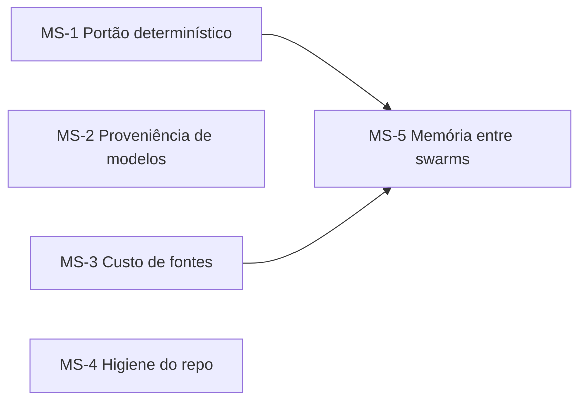

# Plano de Melhoria — Document Swarm

> **Origem:** revisão de arquitetura de 2026-07-13 sobre `SKILL.md`, `README.md`, `scripts/` e as execuções reais em `swarms/`.
> **Executor sugerido:** Opus 4.8 via Copilot CLI.
> **Diagrama do fluxo ideal:** [`fluxo-ideal.excalidraw`](./fluxo-ideal.excalidraw) (verde = componentes novos deste plano).
> **Princípio norteador:** o desenho editorial da skill (especialização + revisão com régua dura + rubber duck com veto) está correto e comprovado — o run `2026-06-29-SWARM-01` pegou aritmética inflada em 8 de 10 linhas via rubber duck. A fronteira de melhoria é adicionar **um mínimo de determinismo nos pontos que bloqueiam a entrega**, sem burocratizar o que já funciona.

## Status de execução

Implementado na skill `2.0.0` em 2026-07-13.

| Issues | Resultado |
| --- | --- |
| 1–4 | `verify_sources.py`, `verify_tables.py`, review YAML, `gate.py` e `final_report.py` integrados ao ciclo. |
| 5 | Validação de modelos contra a sessão, coluna `Status` e `lint_agents.py`. |
| 6–7 | Cache de 7 dias/`--force` e fontes proporcionais ao papel. |
| 8–10 | README desduplicado, caminhos normalizados, `CHANGELOG.md` e `skill_version`. |
| 11–12 | Memória global proposta antes de aplicar; 59 fontes e 13 perfis elegíveis semeados do SWARM-01. |

Evidência automatizada: `python3 -m unittest discover -s tests -v`, incluindo o
caso real das 8 linhas aritmeticamente incorretas e um swarm mínimo ponta a
ponta.

Revisão adversarial final: 12 issues e dimensões transversais aprovadas em A+.

## Sumário dos milestones

| Milestone | Tema | Issues |
| --- | --- | --- |
| MS-1 | Portão determinístico (scripts de verificação + matriz de notas computável) | 1–4 |
| MS-2 | Proveniência de modelos (validação da matriz contra a sessão) | 5 |
| MS-3 | Custo e nuance da regra de fontes | 6–7 |
| MS-4 | Higiene do repositório e versionamento da skill | 8–10 |
| MS-5 | Memória entre swarms | 11–12 |

## Ordem e dependências

- **MS-1 é o coração do plano** — os demais podem correr em paralelo, mas MS-5 depende do cache de fontes (MS-3) e do formato YAML (MS-1).
- **MS-2 e MS-4** são independentes e pequenos; bons primeiros PRs.

## Regras de trabalho para o executor

1. Uma issue = uma branch = um PR (`feat/issue-<n>-<slug>`).
2. **Scripts em Python 3 apenas com stdlib** (o repo já exige Python para o modo apresentação; não adicionar dependências novas para o modo documento).
3. **Fixture de teste real:** o run `swarms/2026-06-29-SWARM-01` é o caso de referência — o `verify_tables.py` (Issue 2) deve ser validado contra as tabelas com totais errados documentadas em `reports/cycle-02-rubberduck.md` daquele run.
4. Toda mudança no `SKILL.md` é mudança de comportamento: registrar no `CHANGELOG.md` (Issue 10) e testar com um swarm pequeno antes do merge.
5. Os scripts são **auxiliares do coordenador**, não substitutos: o LLM continua julgando conteúdo; os scripts verificam o que é mecanicamente verificável (URLs, aritmética, matriz de notas, portão).

---

# Milestone MS-1 — Portão determinístico

Objetivo: os quatro fatos que bloqueiam a entrega (fontes funcionam, números batem, notas ≥ A, ciclos dentro do teto) deixam de ser auto-relatados pelo LLM e passam a ser computados por script. É a correção da lacuna que o próprio rubber duck expôs: os totais inflados do SWARM-01 foram preenchidos "à mão" por um autor e só outro LLM os pegou — por sorte de atenção, não por construção.

## Issue 1 — `scripts/checks/verify_sources.py`: link-checker do sources-index

**Contexto.** A regra "≥5 fontes verificadas (HTTP 200)" é cumprida por afirmação do agente. Um script que varre `sources/sources-index.md`, testa cada URL de verdade e grava o resultado torna a regra verificável e barata.

**Escopo.**
- Script Python (stdlib: `urllib`, `argparse`, `json`) que extrai URLs do `sources-index.md`, faz requisição (HEAD com fallback GET, timeout, user-agent), e grava `sources/sources-check.json` com `{url, status, checked_at}`.
- Saída legível no terminal (ok/quebrada/redirect) + exit code ≠ 0 se alguma fonte citada estiver quebrada.
- Tolerância documentada: alguns sites respondem 403 a bots mas funcionam no `web_fetch` (o SWARM-01 registrou exatamente esse caso em F59/F60) — o script marca `warn`, não `fail`, para 403/429, e o coordenador decide.
- `SKILL.md`: o coordenador roda o script na consolidação de cada ciclo (Fase 3, passo 2) e trata as quebradas antes de despachar revisores.

### SDD

- **Problema:** fonte quebrada ou inventada só é pega se um LLM decidir conferir; a regra central de evidência não tem verificação mecânica.
- **Objetivo:** toda consolidação de ciclo roda um checador real de URLs com resultado gravado e auditável.
- **Não-objetivos:** julgar se a fonte *sustenta* a afirmação (isso continua com revisores e rubber duck).
- **Critérios de aceite:**
  - `ca-1` — Dado um `sources-index.md`, o script testa cada URL e grava `sources-check.json` com status e data. *Verificação:* rodar contra `swarms/2026-06-29-SWARM-01/sources/sources-index.md`.
  - `ca-2` — URL quebrada (DNS/404/5xx) produz exit code ≠ 0 e listagem clara. *Verificação:* fixture com URL inválida.
  - `ca-3` — 403/429 vira `warn`, não `fail`. *Verificação:* fixture simulada (mock de resposta) ou URL conhecida.
- **Risco:** baixo. Script novo, não altera fluxo existente.

## Issue 2 — `scripts/checks/verify_tables.py`: verificador de aritmética declarada

**Contexto.** O caso real do SWARM-01: totais ponderados e scores "preenchidos à mão" em 8 de 10 linhas, incompatíveis com as notas×pesos declaradas na mesma tabela. Esse tipo de erro é 100% detectável por script.

**Escopo.**
- Script que varre tabelas Markdown do documento em `output/` procurando padrões verificáveis: coluna de valores + coluna "total/soma" declarada; linha de pesos + notas + total ponderado; percentuais que devem somar 100.
- Convenção leve para tabelas auditáveis: um comentário HTML acima da tabela (`<!-- check: weighted pesos=20,25,8,... -->`) declara a regra; sem marcação, o script tenta heurísticas simples (colunas "Total"/"Soma") e reporta como `info`.
- Exit code ≠ 0 quando uma tabela marcada não bate; relatório com valor declarado vs. calculado.
- `SKILL.md`: autores marcam tabelas de pontuação com a convenção; o coordenador roda o check na consolidação.

### SDD

- **Problema:** documentos que se vendem como "auditáveis e repetíveis" publicam planilhas cujas contas não batem; a detecção hoje depende de um LLM refazer aritmética.
- **Objetivo:** toda tabela numérica marcada é recalculada mecanicamente a cada ciclo.
- **Não-objetivos:** validar a *escolha* dos pesos ou notas (mérito é dos revisores).
- **Critérios de aceite:**
  - `ca-1` — O script reproduz os 8 erros documentados em `swarms/2026-06-29-SWARM-01/reports/cycle-02-rubberduck.md` a partir das tabelas daquele ciclo. *Verificação:* fixture extraída do run real.
  - `ca-2` — Tabela correta passa sem ruído. *Verificação:* versão final corrigida do mesmo documento.
  - `ca-3` — Tabela marcada com regra `weighted` é validada nota×peso. *Verificação:* fixture sintética.
- **Risco:** médio (parsing de Markdown variado); mitigar começando pelas tabelas marcadas.

## Issue 3 — Matriz de notas computável: `cycle-0N-review.yaml` + `scripts/checks/gate.py`

**Contexto.** As notas vivem em prosa/tabelas `.md`; o portão ("todos ≥ A e sem achado crítico") é avaliado pelo próprio coordenador LLM lendo texto. Um espelho YAML torna o portão uma função, não uma opinião.

**Escopo.**
- Ao consolidar a revisão de cada ciclo, o coordenador grava, além do `.md`, um `reports/cycle-0N-review.yaml`: lista de tópicos com `{topico, nota_minima, revisor_da_minima, bloqueia}` + `rubberduck: {critico: true|false, achados: [...]}`.
- `scripts/checks/gate.py` lê o YAML e responde: aprovado / reprovado (com os tópicos bloqueantes) / escalar (ciclo ≥ max_cycles). Exit codes distintos.
- Escala de notas canonizada no script (D- … A+; A- não passa) — a régua deixa de ser reinterpretável.
- `SKILL.md`: o passo 5 da Fase 3 passa a ser "rode `gate.py`; siga o exit code". No modo apresentação, o mesmo formato ganha a seção `slides:` (nota mínima por slide + dimensões do deck).

### SDD

- **Problema:** o portão que decide a entrega é auto-avaliado em linguagem natural; nota "A-" pode passar por desatenção e o teto de ciclos por esquecimento.
- **Objetivo:** o portão é computado por script a partir de uma matriz estruturada, com a régua canonizada em código.
- **Não-objetivos:** mudar a régua ou o critério (≥ A, crítico veta); só torná-los computáveis.
- **Critérios de aceite:**
  - `ca-1` — YAML com um tópico A- retorna "reprovado" citando o tópico. *Verificação:* fixture.
  - `ca-2` — Todos ≥ A mas `critico: true` retorna "reprovado". *Verificação:* fixture.
  - `ca-3` — Ciclo = max_cycles sem aprovação retorna "escalar". *Verificação:* fixture.
  - `ca-4` — Modo deck: slide B+ bloqueia mesmo com conteúdo todo ≥ A. *Verificação:* fixture com seção `slides:`.
- **Risco:** baixo-médio; o risco real é o LLM preencher o YAML diferente do `.md` — mitigado pelo rubber duck, que passa a conferir a consistência `.md` ↔ `.yaml` (adicionar ao template).

## Issue 4 — `final-report.md` gerado por script + orquestração dos checks no SKILL.md

**Contexto.** Com os YAML da Issue 3 e os JSON das Issues 1–2, o relatório final vira agregação mecânica — hoje é redigido pelo LLM, podendo divergir dos relatórios de ciclo.

**Escopo.**
- `scripts/checks/final_report.py`: gera o esqueleto do `final-report.md` (ciclos, matriz final de notas, nº de fontes verificadas com status, resultado dos checks por ciclo) a partir dos artefatos estruturados; o coordenador complementa com a narrativa (decisões de conteúdo).
- Consolidar no `SKILL.md` a sequência determinística por ciclo: consolidar → `verify_sources.py` → `verify_tables.py` → revisores → YAML → rubber duck → `gate.py`.
- Atualizar o checklist de entrega (os itens verificáveis apontam para os scripts).

### SDD

- **Problema:** o resumo final pode divergir da trilha de ciclos porque é redigido, não derivado.
- **Objetivo:** os fatos do relatório final (notas, ciclos, fontes, checks) são derivados dos artefatos estruturados; o LLM só escreve a narrativa.
- **Critérios de aceite:**
  - `ca-1` — Rodando sobre um swarm completo (fixture do SWARM-01 convertida), o esqueleto bate com os YAML/JSON. *Verificação:* comparação manual documentada no PR.
  - `ca-2` — `SKILL.md` descreve a sequência de checks por ciclo em um único bloco de referência. *Verificação:* leitura + swarm de teste pequeno ponta a ponta.
- **Risco:** baixo.

---

# Milestone MS-2 — Proveniência de modelos

## Issue 5 — Validar a matriz `agent-models.md` contra os modelos da sessão

**Contexto.** O run `2026-07-12-SWARM-01` registrou modelos como `gpt-5.6-sol`, `gpt-5.6-terra` e `barbarvore`. A skill manda usar "somente modelos disponíveis na ferramenta `task`", mas nada confere. Um agente com modelo inexistente cai num default silencioso — corrompendo exatamente a proveniência que a skill promete.

**Escopo.**
- `SKILL.md` (Fase 2, novo passo obrigatório): antes de despachar qualquer agente, listar os modelos realmente disponíveis na sessão e conferir cada linha da matriz; modelo indisponível → substituir pelo equivalente mais próximo **e registrar a substituição** na própria matriz (coluna "substituído de").
- `scripts/checks/lint_agents.py` (opcional, stdlib): valida o frontmatter dos `.md` de agentes (campos obrigatórios presentes, `model` não vazio, `swarm` correto) — não valida disponibilidade (isso só a sessão sabe), mas pega frontmatter malformado.
- Regra de registro: o `agent-models.md` passa a ter a coluna `Status` (`disponível confirmado` / `substituto de <x>`).

### SDD

- **Problema:** nomes de modelo não verificados tornam a matriz de proveniência decorativa; o despacho pode usar outro modelo sem registro.
- **Objetivo:** toda linha da matriz reflete um modelo confirmado na sessão ou uma substituição explícita e registrada.
- **Critérios de aceite:**
  - `ca-1` — SKILL.md contém o passo de confirmação com instrução operacional (como listar os modelos da sessão). *Verificação:* leitura + swarm de teste.
  - `ca-2` — `lint_agents.py` reprova frontmatter sem `model` ou com `swarm` divergente da pasta. *Verificação:* fixtures.
  - `ca-3` — Matriz de um swarm novo exibe a coluna `Status` preenchida. *Verificação:* swarm de teste.
- **Risco:** baixo.

---

# Milestone MS-3 — Custo e nuance da regra de fontes

## Issue 6 — Cache de verificação de fontes entre ciclos

**Contexto.** Re-verificar as mesmas 5+ fontes por agente a cada ciclo é caro (tempo e tokens) e não agrega: fonte verificada no ciclo 1 raramente quebra no ciclo 3.

**Escopo.**
- O `sources-check.json` (Issue 1) vira cache: fonte com verificação < N dias (default 7) não é re-testada; o agente cita o status cacheado (`HTTP 200 em <data>, cache`).
- `SKILL.md`: autores e revisores consultam o cache antes de verificar; só URLs novas ou expiradas passam por `web_fetch`.
- Flag `--force` no script para re-verificação completa (ex.: antes da entrega final).

### SDD

- **Problema:** o rito de verificação repete trabalho idêntico a cada ciclo, inflando custo sem ganho de confiabilidade.
- **Objetivo:** cada URL é verificada uma vez por janela de validade; a entrega final pode forçar re-verificação completa.
- **Critérios de aceite:**
  - `ca-1` — Segunda rodada do script sobre o mesmo índice não refaz requisições dentro da validade. *Verificação:* logs do script em duas execuções seguidas.
  - `ca-2` — `--force` re-testa tudo. *Verificação:* execução com a flag.
- **Risco:** baixo. Depende da Issue 1.

## Issue 7 — Regra de fontes proporcional ao papel

**Contexto.** A regra uniforme "≥5 fontes por agente" força o revisor de "Estrutura & clareza" a coletar 5 URLs para julgar organização de texto — ruído sem valor. A skill já dispensa os revisores de design; falta estender a nuance.

**Escopo.**
- `SKILL.md`: a regra vira por papel — **autores** e revisores de **fatos** (precisão técnica, fontes & evidências, compliance) mantêm ≥5; revisores de **forma** (estrutura/clareza, aderência ao público, narrativa) ficam com "fontes quando contestar um fato" (mesma regra do rubber duck).
- Atualizar templates de revisor (frontmatter `sources_min` passa a variar por dimensão) e o checklist de entrega.

### SDD

- **Problema:** exigência uniforme de fontes gera trabalho ritual em dimensões onde evidência externa não fundamenta o julgamento.
- **Objetivo:** o custo de evidência é proporcional ao tipo de julgamento; nenhuma dimensão de *fato* perde a exigência.
- **Critérios de aceite:**
  - `ca-1` — Templates e SKILL.md distinguem dimensões de fato vs. forma com `sources_min` coerente. *Verificação:* leitura.
  - `ca-2` — Checklist de entrega atualizado sem afrouxar a regra para autores. *Verificação:* leitura.
- **Risco:** baixo; atenção para não sinalizar "relaxamento geral" — o texto deve ser explícito de que autores mantêm a barra.

---

# Milestone MS-4 — Higiene do repositório e versionamento da skill

## Issue 8 — Desduplicar README ↔ SKILL.md

**Contexto.** O README declara o `SKILL.md` como fonte da verdade e em seguida duplica quase tudo (régua, templates, fases, diagramas) — ~1.000 linhas que vão divergir na primeira mudança.

**Escopo.**
- README enxuto: o que é, instalação, exemplos de trigger, estrutura de saída resumida, links para o SKILL.md por seção, estudo de caso.
- Remover do README: templates completos, fases detalhadas, checklists (viram links).

### SDD

- **Problema:** duas fontes da mesma especificação divergem com o tempo; leitores seguem a desatualizada.
- **Objetivo:** cada regra vive em um único lugar (SKILL.md); o README orienta e aponta.
- **Critérios de aceite:**
  - `ca-1` — Nenhum template de agente ou fase detalhada duplicada no README. *Verificação:* diff/leitura.
  - `ca-2` — Todo conteúdo removido tem link equivalente para a seção do SKILL.md. *Verificação:* leitura.
- **Risco:** baixo.

## Issue 9 — Normalizar separadores de caminho e .gitignore

**Contexto.** O SKILL.md usa `\` (estilo Windows) em quase todos os caminhos, mesmo nas instruções Unix; há `.DS_Store` espalhado pelo repo.

**Escopo.**
- Padronizar caminhos com `/` no SKILL.md e README (com nota única: "no Windows, use `\`").
- Adicionar `.DS_Store` ao `.gitignore` e remover os arquivos versionados/presentes.

### SDD

- **Critérios de aceite:**
  - `ca-1` — `grep -c '\\\\' SKILL.md` reduzido aos casos exclusivamente Windows (comandos PowerShell). *Verificação:* grep.
  - `ca-2` — `find . -name .DS_Store` vazio e ignorado. *Verificação:* comando.
- **Risco:** trivial.

## Issue 10 — Versionamento da skill: CHANGELOG + carimbo por swarm

**Contexto.** O "código" da skill é prompt: qualquer edição no SKILL.md muda o comportamento de todos os swarms futuros, e hoje isso é invisível — não dá para saber qual versão da skill produziu qual entrega.

**Escopo.**
- `CHANGELOG.md` na raiz (formato Keep a Changelog, versão semver da skill).
- Campo `skill_version` no topo do SKILL.md; a Fase 1 grava `skill_version` no `brief.md` de cada swarm; o `final-report.md` o repete.
- Regra de trabalho: PR que altera SKILL.md sem entrada no CHANGELOG não passa (registrado no CONTRIBUTING.md).

### SDD

- **Problema:** mudanças de comportamento (edições de prompt) não são rastreáveis até as entregas que produziram.
- **Objetivo:** toda entrega registra a versão exata da skill que a produziu; toda mudança da skill é registrada.
- **Critérios de aceite:**
  - `ca-1` — CHANGELOG existe com a versão atual e retro-registro das mudanças conhecidas. *Verificação:* leitura.
  - `ca-2` — Swarm de teste grava `skill_version` no brief e no final-report. *Verificação:* execução.
- **Risco:** baixo.

---

# Milestone MS-5 — Memória entre swarms

## Issue 11 — Índice global de conhecimento acumulado

**Contexto.** Cada swarm parte do zero, mas o repositório já acumula ativos valiosos: fontes verificadas por domínio (61 só no SWARM-01), perfis de agente que funcionaram, decisões de modelo com justificativa. É o análogo do recall do Loopa, em versão leve.

**Escopo.**
- `memory/index.md` (+ `memory/sources.json`) na raiz do repo: fontes verificadas por domínio/tema (com status e data), perfis de agente reutilizáveis (link para o `.md` original), e observações de calibração (ex.: "revisor de FinOps tende a notas infladas — reforçar persona").
- `scripts/checks/update_memory.py`: ao fim de um swarm, extrai fontes verificadas e perfis do run e propõe a atualização do índice (o humano ou o coordenador aprova o diff — nada é gravado às cegas).
- Curadoria mínima: fontes com `warn`/quebradas não entram; perfis só entram de swarms concluídos (portão aprovado).

### SDD

- **Problema:** conhecimento caro de produzir (fontes verificadas, perfis calibrados) é descartado a cada swarm.
- **Objetivo:** existe um índice curado e versionado do que os swarms anteriores já verificaram e aprenderam.
- **Não-objetivos:** RAG/embeddings — nesta fase é um índice legível, consultado por leitura.
- **Critérios de aceite:**
  - `ca-1` — `update_memory.py` sobre o SWARM-01 propõe as fontes F01–F61 com status. *Verificação:* execução sobre o run real.
  - `ca-2` — Fonte com status `warn`/quebrada não entra no índice. *Verificação:* fixture.
  - `ca-3` — O índice referencia perfis apenas de swarms com portão aprovado. *Verificação:* fixture com swarm escalado.
- **Risco:** médio (curadoria ruim contamina swarms futuros) — mitigado pela aprovação do diff e pelo critério de entrada.

## Issue 12 — Fases 2 e 4 integradas à memória

**Contexto.** O índice só vale se o fluxo o consultar e alimentar sem depender de lembrança.

**Escopo.**
- `SKILL.md` Fase 2: antes de criar agentes, consultar `memory/index.md` — reutilizar/adaptar perfis existentes do domínio (registrando a origem no frontmatter: `derived_from`) e semear a tabela de fontes dos autores com as já verificadas do domínio.
- `SKILL.md` Fase 4: após a entrega, rodar `update_memory.py` e submeter o diff do índice.
- Modo Evolução: consulta obrigatória (o swarm original é a primeira fonte de memória).

### SDD

- **Problema:** sem gancho no fluxo, a memória vira artefato morto.
- **Objetivo:** consultar a memória é passo declarado da Fase 2; alimentá-la é passo declarado da Fase 4.
- **Critérios de aceite:**
  - `ca-1` — Swarm de teste sobre tema já coberto reutiliza ≥1 perfil (`derived_from` preenchido) e ≥3 fontes do índice. *Verificação:* execução de teste com o índice populado pela Issue 11.
  - `ca-2` — Ao final do swarm de teste, o índice recebe o diff proposto. *Verificação:* execução.
- **Risco:** baixo. Depende da Issue 11.

---

# Critério de sucesso do plano

1. Nenhum ciclo fecha sem `verify_sources.py`, `verify_tables.py` e `gate.py` terem rodado — e o portão é o exit code, não uma frase (MS-1).
2. O caso das "planilhas infladas" do SWARM-01 é detectado por script, não por sorte de auditoria (MS-1, Issue 2 `ca-1`).
3. Toda matriz de modelos reflete modelos confirmados na sessão ou substituições registradas (MS-2).
4. O custo de fontes cai (cache + regra proporcional) sem afrouxar a barra para autores e revisores de fato (MS-3).
5. Uma regra da skill vive num único arquivo, com versão carimbada em cada entrega (MS-4).
6. Um swarm novo sobre tema já coberto começa com perfis e fontes herdados do índice de memória (MS-5).

# Apêndice — Mapa recomendação → issue

| Recomendação da revisão | Issues |
| --- | --- |
| (a) Portão auto-relatado → verificação determinística | 1, 2, 3 |
| (b) Matrizes de nota computáveis | 3, 4 |
| (c) Nomes de modelo sem validação | 5 |
| (d) Custo do rito de fontes | 6, 7 |
| (e) Duplicação README ↔ SKILL.md | 8 |
| (f) Sem memória entre swarms | 11, 12 |
| (g) Separadores de caminho, .DS_Store, versionamento | 9, 10 |
